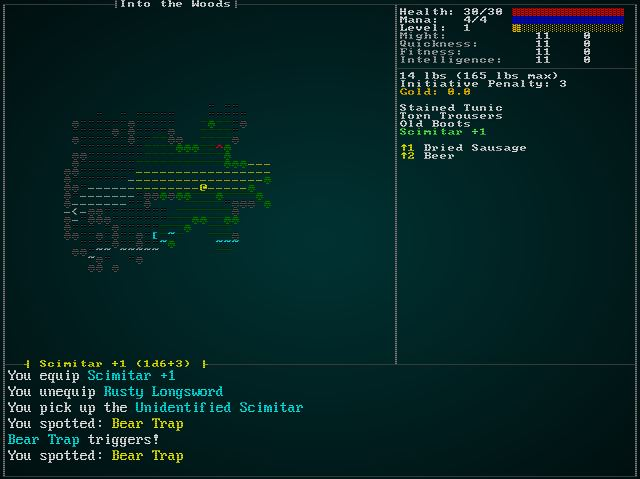

# Text Layers

---

***About this tutorial***

*This tutorial is free and open source, and all code uses the MIT license - so you are free to do with it as you like. My hope is that you will enjoy the tutorial, and make great games!*

*If you enjoy this and would like me to keep writing, please consider supporting [my Patreon](https://www.patreon.com/blackfuture).*

---

The default 8x8 font can get quite hard to read for large blocks of text, especially when combined with post-processing effects. RLTK's graphical console modes (basically everything except `curses`) supports displaying multiple consoles on the same screen, optionally with different fonts. RLTK ships with a VGA font (8x16), which is *much* easier to read. We'll use that, *but only for the log*.

Initialization with a second layer in a VGA font is easy (see RLTK example 2 for details). Expand the builder code in `main.rs`:

```rust
let mut context = RltkBuilder::simple(80, 60)
    .with_title("Roguelike Tutorial")
    .with_font("vga8x16.png", 8, 16)
    .with_sparse_console(80, 30, "vga8x16.png")
    .build();
```

The main loop's "clear screen" needs to be expanded to clear both layers. In `main.rs` (the `tick` function), we have a bit of code we haven't touched in 70 chapters - clearing the screen at the beginning of a frame. Now we want to clear both consoles:

```rust
ctx.set_active_console(1);
ctx.cls();
ctx.set_active_console(0);
ctx.cls();
```

I ran into some problems with the `TextBlock` component and multiple consoles, so I wrote a replacement. In `src/gamelog/logstore.rs` we remove the `display_log` function and add a replacement:

```rust
pub fn print_log(console: &mut Box<dyn Console>, pos: Point) {
    let mut y = pos.y;
    let mut x = pos.x;
    LOG.lock().unwrap().iter().rev().take(6).for_each(|log| {
        log.iter().for_each(|frag| {
            console.print_color(x, y, frag.color, RGB::named(rltk::BLACK), &frag.text);
            x += frag.text.len() as i32;
            x += 1;
        });
        y += 1;
        x = pos.x;
    });
}
```

And correct the exports in `src/gamelog/mod.rs`:

```rust
pub use logstore::{clear_log, clone_log, restore_log, print_log};
```

Since the new code handles rendering, it's very easy to draw the log file! Change the log render in `gui.rs`:

```rust
// Draw the log
gamelog::print_log(&mut ctx.consoles[1].console, Point::new(1, 23));
```

If you `cargo run` now, you'll see a much easier to read log section:



## Let's Clean Up the GUI Code

Since we're working on the GUI, now would be a good time to clean it up. It would be nice to add some mouse support, too. We'll start by turning `gui.rs` into a multi-file module. It's huge, so breaking it up is a win in-and-of itself! Make a new folder, `src/gui` and *move* the `gui.rs` file into it. Then rename that file `mod.rs`. The game will work as before.

Then we do some rearranging:

* Make a new file, `gui/item_render.rs`. Add `mod item_render; pub use item_render::*;` to `gui/mod.rs`, and move the functions `get_item_color` and `get_item_display_name` into it.
* RLTK now supports drawing hollow boxes, so we can delete the `draw_hollow_box` function. Replace calls to `draw_hollow_box(ctx, ...)` with `ctx.draw_hollow_box(...)`.
* Make a new file, `gui/hud.rs`. Add `mod hud; pub use hud::*;` to `gui/mod.rs`. Move the following functions into it: `draw_attribute`, `draw_ui`.
* Make a new file, `gui/tooltips.rs`. Add `mod tooltips; pub use tooltips::*;` to `gui/mod.rs`. Move the `Tooltip` struct and implementation into it, along with the function `draw_tooltips`. You'll have to make that function `pub`.
* Make a new file, `gui/inventory_menu.rs`. Add `mod inventory_menu; pub use inventory_menu::*;` to `gui/mod.rs`. Move the inventory menu code into there.
* It's the same again for item dropping. Make `gui/drop_item_menu.rs`, add `mod drop_item_menu; pub use drop_item_menu::*;` to `mod.rs` and move the item dropping menu.
* Rinse and repeat for `gui/remove_item_menu.rs` and the move item code.
* Repeat once again for `gui/remove_curse_menu.rs`.
* Again - this time `gui/identify_menu.rs`, `gui/ranged_target.rs`, `gui/main_menu.rs`, `gui/game_over_menu.rs`, `gui/cheat_menu.rs` and `gui/vendor_menu.rs`.

There's a lot of import cleanup, also. I recommend referring to the [source code](https://github.com/thebracket/rustrogueliketutorial/tree/master/chapter-72-textlayers) if you aren't sure what's needed. Once that's all done, the `gui/mod.rs` doesn't contain *any* functionality: just pointers to the individual files.

The game should run as it did before: but your compile times have improved (especially on incremental builds)!

## While we're cleaning up - the camera

It's bugged me for a couple of chapters that `camera.rs` isn't in the `map` module. Let's move it there. Move the file into the `map` folder. Add the line `pub mod camera;` to `map/mod.rs`. This leaves a few references to cleanup:

* Remove `pub mod camera;` from `main.rs`.
* Change `use super::` to `use crate::` in `map/camera.rs`.

## Batched Rendering

RLTK recently gained a new rendering feature: the ability to render in batches. This makes rendering compatible with systems (you can't add RLTK as a resource, it has too many thread-unsafe features). We're not going to tackle systems in this chapter, but we will switch to the new rendering path. It's a bit faster, and overall cleaner. The good news is that you can large mix and match the two styles while you switch over.

Start by enabling the system. At the very end of `tick` in `main.rs`, add a single line:

```rust
rltk::render_draw_buffer(ctx);
```

This tells RLTK to submit any draw buffers it has accumulated to the screen. By adding this first, we ensure that anything we switch over will be rendered.

### Batching the camera

Open `map/camera.rs`. Replace the `use rltk::` line with `use rltk::prelude::*;`. Now that RLTK supports a prelude, we should use it! Then, as the first line of `render_camera`, add the following:

```rust
let mut draw_batch = DrawBatch::new();
```

This requests that RLTK create a new "draw batch". These are high-performance, pooled objects that collect drawing instructions and can then be submitted in one go. This is really cache-friendly, and often results in significant improvements in performance.

Replace the first `set` command with `draw_batch.set`:

```rust
// FROM
ctx.set(x as i32+1, y as i32+1, fg, bg, glyph);
// TO
draw_batch.set(
    Point::new(x+1, y+1),
    ColorPair::new(fg, bg),
    glyph
);
```

You'll want to work through, and make the same change for all of the drawing calls. Add a new line at the very end:

```rust
draw_batch.submit(0);
```

This submits the map render as a batch. The completed function looks like this:

```rust
pub fn render_camera(ecs: &World, ctx : &mut Rltk) {
    let mut draw_batch = DrawBatch::new();
    let map = ecs.fetch::<Map>();
    let (min_x, max_x, min_y, max_y) = get_screen_bounds(ecs, ctx);

    // Render the Map

    let map_width = map.width-1;
    let map_height = map.height-1;

    for (y,ty) in (min_y .. max_y).enumerate() {
        for (x,tx) in (min_x .. max_x).enumerate() {
            if tx > 0 && tx < map_width && ty > 0 && ty < map_height {
                let idx = map.xy_idx(tx, ty);
                if map.revealed_tiles[idx] {
                    let (glyph, fg, bg) = tile_glyph(idx, &*map);
                    draw_batch.set(
                        Point::new(x+1, y+1),
                        ColorPair::new(fg, bg),
                        glyph
                    );
                }
            } else if SHOW_BOUNDARIES {
                draw_batch.set(
                    Point::new(x+1, y+1),
                    ColorPair::new(RGB::named(rltk::GRAY), RGB::named(rltk::BLACK)),
                    to_cp437('·')
                );
            }
        }
    }

    // Render entities
    let positions = ecs.read_storage::<Position>();
    let renderables = ecs.read_storage::<Renderable>();
    let hidden = ecs.read_storage::<Hidden>();
    let map = ecs.fetch::<Map>();
    let sizes = ecs.read_storage::<TileSize>();
    let entities = ecs.entities();
    let targets = ecs.read_storage::<Target>();

    let mut data = (&positions, &renderables, &entities, !&hidden).join().collect::<Vec<_>>();
    data.sort_by(|&a, &b| b.1.render_order.cmp(&a.1.render_order) );
    for (pos, render, entity, _hidden) in data.iter() {
        if let Some(size) = sizes.get(*entity) {
            for cy in 0 .. size.y {
                for cx in 0 .. size.x {
                    let tile_x = cx + pos.x;
                    let tile_y = cy + pos.y;
                    let idx = map.xy_idx(tile_x, tile_y);
                    if map.visible_tiles[idx] {
                        let entity_screen_x = (cx + pos.x) - min_x;
                        let entity_screen_y = (cy + pos.y) - min_y;
                        if entity_screen_x > 0 && entity_screen_x < map_width && entity_screen_y > 0 && entity_screen_y < map_height {
                            draw_batch.set(
                                Point::new(entity_screen_x + 1, entity_screen_y + 1),
                                ColorPair::new(render.fg, render.bg),
                                render.glyph
                            );
                        }
                    }
                }
            }
        } else {
            let idx = map.xy_idx(pos.x, pos.y);
            if map.visible_tiles[idx] {
                let entity_screen_x = pos.x - min_x;
                let entity_screen_y = pos.y - min_y;
                if entity_screen_x > 0 && entity_screen_x < map_width && entity_screen_y > 0 && entity_screen_y < map_height {
                    draw_batch.set(
                        Point::new(entity_screen_x + 1, entity_screen_y + 1),
                        ColorPair::new(render.fg, render.bg),
                        render.glyph
                    );
                }
            }
        }

        if targets.get(*entity).is_some() {
            let entity_screen_x = pos.x - min_x;
            let entity_screen_y = pos.y - min_y;
            draw_batch.set(
                Point::new(entity_screen_x , entity_screen_y + 1),
                ColorPair::new(RGB::named(rltk::RED), RGB::named(rltk::YELLOW)),
                to_cp437('[')
            );
            draw_batch.set(
                Point::new(entity_screen_x +2, entity_screen_y + 1),
                ColorPair::new(RGB::named(rltk::RED), RGB::named(rltk::YELLOW)),
                to_cp437(']')
            );
        }
    }

    draw_batch.submit(0);
}
```

If you `cargo run` now, it is mostly the same as before: but tool-tips that normally appear on top of the map aren't visible (they are underneath because we submitted at the end).

## Batching the GUI

We'll start with `gui/hud.rs` because it's the messiest! Add a `let mut draw_batch = DrawBatch::new();` to the beginning, and a `draw_batch.submit(5000);` to the end. Why `5,000`? There are 80x60 (4,800) possible tiles in the map. The provided number acts as a sort: so we're guaranteeing that we'll draw the GUI after the map. Then it's a matter of converting the `ctx` calls to equivalent batch calls. It's also a good time to break the giant `draw_gui` function into smaller pieces. The completely refactor `gui/hud.rs` looks like this:

```rust
use rltk::prelude::*;
use specs::prelude::*;
use crate::{Pools, Map, Name, InBackpack,
    Equipped, HungerClock, HungerState, Attributes, Attribute, Consumable,
    StatusEffect, Duration, KnownSpells, Weapon, gamelog };
use super::{draw_tooltips, get_item_display_name, get_item_color};

fn draw_attribute(name : &str, attribute : &Attribute, y : i32, draw_batch: &mut DrawBatch) {
    let black = RGB::named(rltk::BLACK);
    let attr_gray : RGB = RGB::from_hex("#CCCCCC").expect("Oops");
    draw_batch.print_color(Point::new(50, y), name, ColorPair::new(attr_gray, black));
    let color : RGB =
        if attribute.modifiers < 0 { RGB::from_f32(1.0, 0.0, 0.0) }
        else if attribute.modifiers == 0 { RGB::named(rltk::WHITE) }
        else { RGB::from_f32(0.0, 1.0, 0.0) };
    draw_batch.print_color(Point::new(67, y), &format!("{}", attribute.base + attribute.modifiers), ColorPair::new(color, black));
    draw_batch.print_color(Point::new(73, y), &format!("{}", attribute.bonus), ColorPair::new(color, black));
    if attribute.bonus > 0 { 
        draw_batch.set(Point::new(72, y), ColorPair::new(color, black), to_cp437('+')); 
    }
}

fn box_framework(draw_batch : &mut DrawBatch) {
    let box_gray : RGB = RGB::from_hex("#999999").expect("Oops");
    let black = RGB::named(rltk::BLACK);

    draw_batch.draw_hollow_box(Rect::with_size(0, 0, 79, 59), ColorPair::new(box_gray, black)); // Overall box
    draw_batch.draw_hollow_box(Rect::with_size(0, 0, 49, 45), ColorPair::new(box_gray, black)); // Map box
    draw_batch.draw_hollow_box(Rect::with_size(0, 45, 79, 14), ColorPair::new(box_gray, black)); // Log box
    draw_batch.draw_hollow_box(Rect::with_size(49, 0, 30, 8), ColorPair::new(box_gray, black)); // Top-right panel

    // Draw box connectors
    draw_batch.set(Point::new(0, 45), ColorPair::new(box_gray, black), to_cp437('├'));
    draw_batch.set(Point::new(49, 8), ColorPair::new(box_gray, black), to_cp437('├'));
    draw_batch.set(Point::new(49, 0), ColorPair::new(box_gray, black), to_cp437('┬'));
    draw_batch.set(Point::new(49, 45), ColorPair::new(box_gray, black), to_cp437('┴'));
    draw_batch.set(Point::new(79, 8), ColorPair::new(box_gray, black), to_cp437('┤'));
    draw_batch.set(Point::new(79, 45), ColorPair::new(box_gray, black), to_cp437('┤'));
}

pub fn map_label(ecs: &World, draw_batch: &mut DrawBatch) {
    let box_gray : RGB = RGB::from_hex("#999999").expect("Oops");
    let black = RGB::named(rltk::BLACK);
    let white = RGB::named(rltk::WHITE);

    let map = ecs.fetch::<Map>();
    let name_length = map.name.len() + 2;
    let x_pos = (22 - (name_length / 2)) as i32;
    draw_batch.set(Point::new(x_pos, 0), ColorPair::new(box_gray, black), to_cp437('┤'));
    draw_batch.set(Point::new(x_pos + name_length as i32 - 1, 0), ColorPair::new(box_gray, black), to_cp437('├'));
    draw_batch.print_color(Point::new(x_pos+1, 0), &map.name, ColorPair::new(white, black));
}

fn draw_stats(ecs: &World, draw_batch: &mut DrawBatch, player_entity: &Entity) {
    let black = RGB::named(rltk::BLACK);
    let white = RGB::named(rltk::WHITE);
    let pools = ecs.read_storage::<Pools>();
    let player_pools = pools.get(*player_entity).unwrap();
    let health = format!("Health: {}/{}", player_pools.hit_points.current, player_pools.hit_points.max);
    let mana =   format!("Mana:   {}/{}", player_pools.mana.current, player_pools.mana.max);
    let xp =     format!("Level:  {}", player_pools.level);
    draw_batch.print_color(Point::new(50, 1), &health, ColorPair::new(white, black));
    draw_batch.print_color(Point::new(50, 2), &mana, ColorPair::new(white, black));
    draw_batch.print_color(Point::new(50, 3), &xp, ColorPair::new(white, black));
    draw_batch.bar_horizontal(
        Point::new(64, 1), 
        14, 
        player_pools.hit_points.current, 
        player_pools.hit_points.max, 
        ColorPair::new(RGB::named(rltk::RED), RGB::named(rltk::BLACK))
    );
    draw_batch.bar_horizontal(
        Point::new(64, 2), 
        14, 
        player_pools.mana.current, 
        player_pools.mana.max, 
        ColorPair::new(RGB::named(rltk::BLUE), RGB::named(rltk::BLACK))
    );
    let xp_level_start = (player_pools.level-1) * 1000;
    draw_batch.bar_horizontal(
        Point::new(64, 3), 
        14, 
        player_pools.xp - xp_level_start, 
        1000, 
        ColorPair::new(RGB::named(rltk::GOLD), RGB::named(rltk::BLACK))
    );
}

fn draw_attributes(ecs: &World, draw_batch: &mut DrawBatch, player_entity: &Entity) {
    let attributes = ecs.read_storage::<Attributes>();
    let attr = attributes.get(*player_entity).unwrap();
    draw_attribute("Might:", &attr.might, 4, draw_batch);
    draw_attribute("Quickness:", &attr.quickness, 5, draw_batch);
    draw_attribute("Fitness:", &attr.fitness, 6, draw_batch);
    draw_attribute("Intelligence:", &attr.intelligence, 7, draw_batch);
}

fn initiative_weight(ecs: &World, draw_batch: &mut DrawBatch, player_entity: &Entity) {
    let attributes = ecs.read_storage::<Attributes>();
    let attr = attributes.get(*player_entity).unwrap();
    let black = RGB::named(rltk::BLACK);
    let white = RGB::named(rltk::WHITE);
    let pools = ecs.read_storage::<Pools>();
    let player_pools = pools.get(*player_entity).unwrap();
    draw_batch.print_color(
        Point::new(50, 9),
        &format!("{:.0} lbs ({} lbs max)",
            player_pools.total_weight,
            (attr.might.base + attr.might.modifiers) * 15
        ),
        ColorPair::new(white, black)
    );
    draw_batch.print_color(
        Point::new(50,10), 
        &format!("Initiative Penalty: {:.0}", player_pools.total_initiative_penalty),
        ColorPair::new(white, black)
    );
    draw_batch.print_color(
        Point::new(50,11), 
        &format!("Gold: {:.1}", player_pools.gold),
        ColorPair::new(RGB::named(rltk::GOLD), black)
    );
}

fn equipped(ecs: &World, draw_batch: &mut DrawBatch, player_entity: &Entity) -> i32 {
    let black = RGB::named(rltk::BLACK);
    let yellow = RGB::named(rltk::YELLOW);
    let mut y = 13;
    let entities = ecs.entities();
    let equipped = ecs.read_storage::<Equipped>();
    let weapon = ecs.read_storage::<Weapon>();
    for (entity, equipped_by) in (&entities, &equipped).join() {
        if equipped_by.owner == *player_entity {
            let name = get_item_display_name(ecs, entity);
            draw_batch.print_color(
                Point::new(50, y), 
                &name,
                ColorPair::new(get_item_color(ecs, entity), black));
            y += 1;

            if let Some(weapon) = weapon.get(entity) {
                let mut weapon_info = if weapon.damage_bonus < 0 {
                    format!("┤ {} ({}d{}{})", &name, weapon.damage_n_dice, weapon.damage_die_type, weapon.damage_bonus)
                } else if weapon.damage_bonus == 0 {
                    format!("┤ {} ({}d{})", &name, weapon.damage_n_dice, weapon.damage_die_type)
                } else {
                    format!("┤ {} ({}d{}+{})", &name, weapon.damage_n_dice, weapon.damage_die_type, weapon.damage_bonus)
                };

                if let Some(range) = weapon.range {
                    weapon_info += &format!(" (range: {}, F to fire, V cycle targets)", range);
                }
                weapon_info += " ├";
                draw_batch.print_color(
                    Point::new(3, 45),
                    &weapon_info,
                    ColorPair::new(yellow, black));
            }
        }
    }
    y
}

fn consumables(ecs: &World, draw_batch: &mut DrawBatch, player_entity: &Entity, mut y : i32) -> i32 {
    y += 1;
    let black = RGB::named(rltk::BLACK);
    let yellow = RGB::named(rltk::YELLOW);
    let entities = ecs.entities();
    let consumables = ecs.read_storage::<Consumable>();
    let backpack = ecs.read_storage::<InBackpack>();
    let mut index = 1;
    for (entity, carried_by, _consumable) in (&entities, &backpack, &consumables).join() {
        if carried_by.owner == *player_entity && index < 10 {
            draw_batch.print_color(
                Point::new(50, y), 
                &format!("↑{}", index),
                ColorPair::new(yellow, black)
            );
            draw_batch.print_color(
                Point::new(53, y), 
                &get_item_display_name(ecs, entity),
                ColorPair::new(get_item_color(ecs, entity), black)
            );
            y += 1;
            index += 1;
        }
    }
    y
}

fn spells(ecs: &World, draw_batch: &mut DrawBatch, player_entity: &Entity, mut y : i32) -> i32 {
    y += 1;
    let black = RGB::named(rltk::BLACK);
    let blue = RGB::named(rltk::CYAN);
    let known_spells_storage = ecs.read_storage::<KnownSpells>();
    let known_spells = &known_spells_storage.get(*player_entity).unwrap().spells;
    let mut index = 1;
    for spell in known_spells.iter() {
        draw_batch.print_color(
            Point::new(50, y),
            &format!("^{}", index),
            ColorPair::new(blue, black)
        );
        draw_batch.print_color(
            Point::new(53, y),
            &format!("{} ({})", &spell.display_name, spell.mana_cost),
            ColorPair::new(blue, black)
        );
        index += 1;
        y += 1;
    }
    y
}

fn status(ecs: &World, draw_batch: &mut DrawBatch, player_entity: &Entity) {
    let mut y = 44;
    let hunger = ecs.read_storage::<HungerClock>();
    let hc = hunger.get(*player_entity).unwrap();
    match hc.state {
        HungerState::WellFed => {
            draw_batch.print_color(
                Point::new(50, y), 
                "Well Fed",
                ColorPair::new(RGB::named(rltk::GREEN), RGB::named(rltk::BLACK))
            );
            y -= 1;
        }
        HungerState::Normal => {}
        HungerState::Hungry => {
            draw_batch.print_color(
                Point::new(50, y),
                "Hungry",
                ColorPair::new(RGB::named(rltk::ORANGE), RGB::named(rltk::BLACK))
            );
            y -= 1;
        }
        HungerState::Starving => {
            draw_batch.print_color(
                Point::new(50, y),
                "Starving",
                ColorPair::new(RGB::named(rltk::RED), RGB::named(rltk::BLACK))
            );
            y -= 1;
        }
    }
    let statuses = ecs.read_storage::<StatusEffect>();
    let durations = ecs.read_storage::<Duration>();
    let names = ecs.read_storage::<Name>();
    for (status, duration, name) in (&statuses, &durations, &names).join() {
        if status.target == *player_entity {
            draw_batch.print_color(
                Point::new(50, y),
                &format!("{} ({})", name.name, duration.turns),
                ColorPair::new(RGB::named(rltk::RED), RGB::named(rltk::BLACK)),
            );
            y -= 1;
        }
    }
}

pub fn draw_ui(ecs: &World, ctx : &mut Rltk) {
    let mut draw_batch = DrawBatch::new();
    let player_entity = ecs.fetch::<Entity>();

    box_framework(&mut draw_batch);
    map_label(ecs, &mut draw_batch);
    draw_stats(ecs, &mut draw_batch, &player_entity);
    draw_attributes(ecs, &mut draw_batch, &player_entity);
    initiative_weight(ecs, &mut draw_batch, &player_entity);
    let mut y = equipped(ecs, &mut draw_batch, &player_entity);
    y += consumables(ecs, &mut draw_batch, &player_entity, y);
    spells(ecs, &mut draw_batch, &player_entity, y);
    status(ecs, &mut draw_batch, &player_entity);
    gamelog::print_log(&mut ctx.consoles[1].console, Point::new(1, 23));
    draw_tooltips(ecs, ctx);

    draw_batch.submit(5000);
}
```

## Batching the menus

There's a lot of shared functionality between our various menus that could be combined into helper functions. With batching in mind, we'll first build a new module `gui/menus.rs` to hold the common functionality:

```rust
use rltk::prelude::*;

pub fn menu_box<T: ToString>(draw_batch: &mut DrawBatch, x: i32, y: i32, width: i32, title: T) {
    draw_batch.draw_box(
        Rect::with_size(x, y-2, 31, width), 
        ColorPair::new(RGB::named(rltk::WHITE), RGB::named(rltk::BLACK))
    );
    draw_batch.print_color(
        Point::new(18, y-2), 
        &title.to_string(),
        ColorPair::new(RGB::named(rltk::MAGENTA), RGB::named(rltk::BLACK))
    );
}

pub fn menu_option<T:ToString>(draw_batch: &mut DrawBatch, x: i32, y: i32, hotkey: u8, text: T) {
    draw_batch.set(
        Point::new(x, y), 
        ColorPair::new(RGB::named(rltk::WHITE), RGB::named(rltk::BLACK)),
        rltk::to_cp437('(')
    );
    draw_batch.set(
        Point::new(x+1, y), 
        ColorPair::new(RGB::named(rltk::YELLOW), RGB::named(rltk::BLACK)),
        hotkey
    );
    draw_batch.set(
        Point::new(x+2, y), 
        ColorPair::new(RGB::named(rltk::WHITE), RGB::named(rltk::BLACK)), 
        rltk::to_cp437(')')
    );
    draw_batch.print_color(
        Point::new(x+5, y), 
        &text.to_string(),
        ColorPair::new(RGB::named(rltk::YELLOW), RGB::named(rltk::BLACK))
    );
}
```

Don't forget to modify `gui/mod.rs` to expose the functionality:

```rust
mod menus;
pub use menus::*;
```

### Cheat Menu

With the new helper, the `gui/cheat_menur.rs` file is an easy refactor:

```rust
use rltk::prelude::*;
use crate::State;
use super::{menu_option, menu_box};

#[derive(PartialEq, Copy, Clone)]
pub enum CheatMenuResult { NoResponse, Cancel, TeleportToExit, Heal, Reveal, GodMode }

pub fn show_cheat_mode(_gs : &mut State, ctx : &mut Rltk) -> CheatMenuResult {
    let mut draw_batch = DrawBatch::new();
    let count = 4;
    let mut y = (25 - (count / 2)) as i32;
    menu_box(&mut draw_batch, 15, y, (count+3) as i32, "Cheating!");
    draw_batch.print_color(
        Point::new(18, y+count as i32+1),
        "ESCAPE to cancel",
        ColorPair::new(RGB::named(rltk::YELLOW), RGB::named(rltk::BLACK))
    );

    menu_option(&mut draw_batch, 17, y, rltk::to_cp437('T'), "Teleport to next level");
    y += 1;
    menu_option(&mut draw_batch, 17, y, rltk::to_cp437('H'), "Heal all wounds");
    y += 1;
    menu_option(&mut draw_batch, 17, y, rltk::to_cp437('R'), "Reveal the map");
    y += 1;
    menu_option(&mut draw_batch, 17, y, rltk::to_cp437('G'), "God Mode (No Death)");

    draw_batch.submit(6000);

    match ctx.key {
        None => CheatMenuResult::NoResponse,
        Some(key) => {
            match key {
                VirtualKeyCode::T => CheatMenuResult::TeleportToExit,
                VirtualKeyCode::H => CheatMenuResult::Heal,
                VirtualKeyCode::R => CheatMenuResult::Reveal,
                VirtualKeyCode::G => CheatMenuResult::GodMode,
                VirtualKeyCode::Escape => CheatMenuResult::Cancel,
                _ => CheatMenuResult::NoResponse
            }
        }
    }
}
```

### Drop Item Menu

For the various item menus, another helper is useful to reduce duplicated code. In `gui/menus.rs` add the following:

```rust
pub fn item_result_menu<S: ToString>(
    draw_batch: &mut DrawBatch,
    title: S,
    count: usize,
    items: &[(Entity, String)],
    key: Option<VirtualKeyCode>
) -> (ItemMenuResult, Option<Entity>) {

    let mut y = (25 - (count / 2)) as i32;
    draw_batch.draw_box(
        Rect::with_size(15, y-2, 31, (count+3) as i32), 
        ColorPair::new(RGB::named(rltk::WHITE), RGB::named(rltk::BLACK))
    );
    draw_batch.print_color(
        Point::new(18, y-2), 
        &title.to_string(),
        ColorPair::new(RGB::named(rltk::YELLOW), RGB::named(rltk::BLACK))
    );
    draw_batch.print_color(
        Point::new(18, y+count as i32+1),
        "ESCAPE to cancel",
        ColorPair::new(RGB::named(rltk::YELLOW), RGB::named(rltk::BLACK))
    );

    let mut item_list : Vec<Entity> = Vec::new();
    let mut j = 0;
    for item in items {
        menu_option(draw_batch, 17, y, 97+j as u8, &item.1);
        item_list.push(item.0);
        y += 1;
        j += 1;
    }

    match key {
        None => (ItemMenuResult::NoResponse, None),
        Some(key) => {
            match key {
                VirtualKeyCode::Escape => { (ItemMenuResult::Cancel, None) }
                _ => {
                    let selection = rltk::letter_to_option(key);
                    if selection > -1 && selection < count as i32 {
                        return (ItemMenuResult::Selected, Some(item_list[selection as usize]));
                    }
                    (ItemMenuResult::NoResponse, None)
                }
            }
        }
    }
}
```

This is basically a generic version of our other menus that return an `ItemMenuResult`. We can use it to significantly simplify `gui/drop_item_menu.rs`:

```rust
use rltk::prelude::*;
use specs::prelude::*;
use crate::{State, InBackpack};
use super::{get_item_display_name, ItemMenuResult, item_result_menu};

pub fn drop_item_menu(gs : &mut State, ctx : &mut Rltk) -> (ItemMenuResult, Option<Entity>) {
    let mut draw_batch = DrawBatch::new();

    let player_entity = gs.ecs.fetch::<Entity>();
    let backpack = gs.ecs.read_storage::<InBackpack>();
    let entities = gs.ecs.entities();

    let mut items : Vec<(Entity, String)> = Vec::new();
    (&entities, &backpack).join()
        .filter(|item| item.1.owner == *player_entity )
        .for_each(|item| {
            items.push((item.0, get_item_display_name(&gs.ecs, item.0)))
        });

    let result = item_result_menu(
        &mut draw_batch,
        "Drop which item?",
        items.len(),
        &items,
        ctx.key
    );
    draw_batch.submit(6000);
    result
}
```

### Remove Item Menu

The same helper code makes `gui/remove_item_menu.rs` shorter, also:

```rust
use rltk::prelude::*;
use specs::prelude::*;
use crate::{State, Equipped };
use super::{get_item_display_name, ItemMenuResult, item_result_menu};

pub fn remove_item_menu(gs : &mut State, ctx : &mut Rltk) -> (ItemMenuResult, Option<Entity>) {
    let mut draw_batch = DrawBatch::new();

    let player_entity = gs.ecs.fetch::<Entity>();
    let backpack = gs.ecs.read_storage::<Equipped>();
    let entities = gs.ecs.entities();

    let mut items : Vec<(Entity, String)> = Vec::new();
    (&entities, &backpack).join()
        .filter(|item| item.1.owner == *player_entity )
        .for_each(|item| {
            items.push((item.0, get_item_display_name(&gs.ecs, item.0)))
        });

    let result = item_result_menu(
        &mut draw_batch,
        "Remove which item?",
        items.len(),
        &items,
        ctx.key
    );
    draw_batch.submit(6000);
    result
}
```

### Inventory Menu

Once again, our helper greatly simplifies the inventory menu. We can replace `gui/inventory_menu.rs` with:

```rust
use rltk::prelude::*;
use specs::prelude::*;
use crate::{State, InBackpack };
use super::{get_item_display_name, item_result_menu};

#[derive(PartialEq, Copy, Clone)]
pub enum ItemMenuResult { Cancel, NoResponse, Selected }

pub fn show_inventory(gs : &mut State, ctx : &mut Rltk) -> (ItemMenuResult, Option<Entity>) {
    let player_entity = gs.ecs.fetch::<Entity>();
    let backpack = gs.ecs.read_storage::<InBackpack>();
    let entities = gs.ecs.entities();

    let mut draw_batch = DrawBatch::new();

    let mut items : Vec<(Entity, String)> = Vec::new();
    (&entities, &backpack).join()
        .filter(|item| item.1.owner == *player_entity )
        .for_each(|item| {
            items.push((item.0, get_item_display_name(&gs.ecs, item.0)))
        });

    let result = item_result_menu(
        &mut draw_batch,
        "Inventory",
        items.len(),
        &items,
        ctx.key
    );
    draw_batch.submit(6000);
    result
}
```

### Identify Menu

The helper is somewhat useful in shortening the `gui/identify_menu.rs` also - but the complex filter is still rather long. Replace the file contents with the following:

```rust
use rltk::prelude::*;
use specs::prelude::*;
use crate::{Name, State, InBackpack, Equipped, MasterDungeonMap, Item, ObfuscatedName };
use super::{get_item_display_name, item_result_menu, ItemMenuResult};

pub fn identify_menu(gs : &mut State, ctx : &mut Rltk) -> (ItemMenuResult, Option<Entity>) {
    let mut draw_batch = DrawBatch::new();

    let player_entity = gs.ecs.fetch::<Entity>();
    let equipped = gs.ecs.read_storage::<Equipped>();
    let backpack = gs.ecs.read_storage::<InBackpack>();
    let entities = gs.ecs.entities();
    let item_components = gs.ecs.read_storage::<Item>();
    let names = gs.ecs.read_storage::<Name>();
    let dm = gs.ecs.fetch::<MasterDungeonMap>();
    let obfuscated = gs.ecs.read_storage::<ObfuscatedName>();

    let mut items : Vec<(Entity, String)> = Vec::new();
    (&entities, &item_components).join()
        .filter(|(item_entity,_item)| {
            let mut keep = false;
            if let Some(bp) = backpack.get(*item_entity) {
                if bp.owner == *player_entity {
                    if let Some(name) = names.get(*item_entity) {
                        if obfuscated.get(*item_entity).is_some() && !dm.identified_items.contains(&name.name) {
                            keep = true;
                        }
                    }
                }
            }
            // It's equipped, so we know it's cursed
            if let Some(equip) = equipped.get(*item_entity) {
                if equip.owner == *player_entity {
                    if let Some(name) = names.get(*item_entity) {
                        if obfuscated.get(*item_entity).is_some() && !dm.identified_items.contains(&name.name) {
                            keep = true;
                        }
                    }
                }
            }
            keep
        })
        .for_each(|item| {
            items.push((item.0, get_item_display_name(&gs.ecs, item.0)))
        });

    let result = item_result_menu(
        &mut draw_batch,
        "Inventory",
        items.len(),
        &items,
        ctx.key
    );
    draw_batch.submit(6000);
    result
}
```

### Remove Curse Menu

The remove curse menu is very similar to the identification menu, so the same principles apply. Replace `gui/remove_curse_menu.rs` with:

```rust
use rltk::prelude::*;
use specs::prelude::*;
use crate::{Name, State, InBackpack, Equipped, MasterDungeonMap, CursedItem, Item };
use super::{get_item_display_name, item_result_menu, ItemMenuResult};

pub fn remove_curse_menu(gs : &mut State, ctx : &mut Rltk) -> (ItemMenuResult, Option<Entity>) {
    let player_entity = gs.ecs.fetch::<Entity>();
    let equipped = gs.ecs.read_storage::<Equipped>();
    let backpack = gs.ecs.read_storage::<InBackpack>();
    let entities = gs.ecs.entities();
    let item_components = gs.ecs.read_storage::<Item>();
    let cursed = gs.ecs.read_storage::<CursedItem>();
    let names = gs.ecs.read_storage::<Name>();
    let dm = gs.ecs.fetch::<MasterDungeonMap>();

    let mut draw_batch = DrawBatch::new();

    let mut items : Vec<(Entity, String)> = Vec::new();
    (&entities, &item_components, &cursed).join()
        .filter(|(item_entity,_item,_cursed)| {
            let mut keep = false;
            if let Some(bp) = backpack.get(*item_entity) {
                if bp.owner == *player_entity {
                    if let Some(name) = names.get(*item_entity) {
                        if dm.identified_items.contains(&name.name) {
                            keep = true;
                        }
                    }
                }
            }
            // It's equipped, so we know it's cursed
            if let Some(equip) = equipped.get(*item_entity) {
                if equip.owner == *player_entity {
                    keep = true;
                }
            }
            keep
        })
        .for_each(|item| {
            items.push((item.0, get_item_display_name(&gs.ecs, item.0)))
        });

    let result = item_result_menu(
        &mut draw_batch,
        "Inventory",
        items.len(),
        &items,
        ctx.key
    );
    draw_batch.submit(6000);
    result
}
```

### Game Over Menu

The game over menu is a simple `ctx` to `DrawBatch` port. In `gui/game_over_menu.rs`:

```rust
use rltk::prelude::*;

#[derive(PartialEq, Copy, Clone)]
pub enum GameOverResult { NoSelection, QuitToMenu }

pub fn game_over(ctx : &mut Rltk) -> GameOverResult {
    let mut draw_batch = DrawBatch::new();
    draw_batch.print_color_centered(
        15, 
        "Your journey has ended!",
        ColorPair::new(RGB::named(rltk::YELLOW), RGB::named(rltk::BLACK))
    );
    draw_batch.print_color_centered(
        17, 
        "One day, we'll tell you all about how you did.",
        ColorPair::new(RGB::named(rltk::WHITE), RGB::named(rltk::BLACK))
    );
    draw_batch.print_color_centered(
        18, 
        "That day, sadly, is not in this chapter..",
        ColorPair::new(RGB::named(rltk::WHITE), RGB::named(rltk::BLACK))
    );

    draw_batch.print_color_centered(
        19,
        &format!("You lived for {} turns.", crate::gamelog::get_event_count("Turn")),
        ColorPair::new(RGB::named(rltk::WHITE), RGB::named(rltk::BLACK))
    );
    draw_batch.print_color_centered(
        20,
        &format!("You suffered {} points of damage.", crate::gamelog::get_event_count("Damage Taken")),
        ColorPair::new(RGB::named(rltk::RED), RGB::named(rltk::BLACK))
    );
    draw_batch.print_color_centered(
        21,
        &format!("You inflicted {} points of damage.", crate::gamelog::get_event_count("Damage Inflicted")),
        ColorPair::new(RGB::named(rltk::RED), RGB::named(rltk::BLACK)));

    draw_batch.print_color_centered(
        23,
        "Press any key to return to the menu.",
        ColorPair::new(RGB::named(rltk::MAGENTA), RGB::named(rltk::BLACK))
    );

    draw_batch.submit(6000);

    match ctx.key {
        None => GameOverResult::NoSelection,
        Some(_) => GameOverResult::QuitToMenu
    }
}
```

### Ranged Targeting Menu

`gui/ranged_target.rs` is another simple conversion:

```rust
use rltk::prelude::*;
use specs::prelude::*;
use crate::{State, camera, Viewshed };
use super::ItemMenuResult;

pub fn ranged_target(gs : &mut State, ctx : &mut Rltk, range : i32) -> (ItemMenuResult, Option<Point>) {
    let (min_x, max_x, min_y, max_y) = camera::get_screen_bounds(&gs.ecs, ctx);
    let player_entity = gs.ecs.fetch::<Entity>();
    let player_pos = gs.ecs.fetch::<Point>();
    let viewsheds = gs.ecs.read_storage::<Viewshed>();

    let mut draw_batch = DrawBatch::new();

    draw_batch.print_color(
        Point::new(5, 0), 
        "Select Target:",
        ColorPair::new(RGB::named(rltk::YELLOW), RGB::named(rltk::BLACK))
    );

    // Highlight available target cells
    let mut available_cells = Vec::new();
    let visible = viewsheds.get(*player_entity);
    if let Some(visible) = visible {
        // We have a viewshed
        for idx in visible.visible_tiles.iter() {
            let distance = rltk::DistanceAlg::Pythagoras.distance2d(*player_pos, *idx);
            if distance <= range as f32 {
                let screen_x = idx.x - min_x;
                let screen_y = idx.y - min_y;
                if screen_x > 1 && screen_x < (max_x - min_x)-1 && screen_y > 1 && screen_y < (max_y - min_y)-1 {
                    draw_batch.set_bg(Point::new(screen_x, screen_y), RGB::named(rltk::BLUE));
                    available_cells.push(idx);
                }
            }
        }
    } else {
        return (ItemMenuResult::Cancel, None);
    }

    // Draw mouse cursor
    let mouse_pos = ctx.mouse_pos();
    let mut mouse_map_pos = mouse_pos;
    mouse_map_pos.0 += min_x - 1;
    mouse_map_pos.1 += min_y - 1;
    let mut valid_target = false;
    for idx in available_cells.iter() { if idx.x == mouse_map_pos.0 && idx.y == mouse_map_pos.1 { valid_target = true; } }
    if valid_target {
        draw_batch.set_bg(Point::new(mouse_pos.0, mouse_pos.1), RGB::named(rltk::CYAN));
        if ctx.left_click {
            return (ItemMenuResult::Selected, Some(Point::new(mouse_map_pos.0, mouse_map_pos.1)));
        }
    } else {
        draw_batch.set_bg(Point::new(mouse_pos.0, mouse_pos.1), RGB::named(rltk::RED));
        if ctx.left_click {
            return (ItemMenuResult::Cancel, None);
        }
    }

    draw_batch.submit(5000);

    (ItemMenuResult::NoResponse, None)
}
```

### Main Menu

The `gui/main_menu.rs` file is another simple conversion:

```rust
use rltk::prelude::*;
use crate::{State, RunState, rex_assets::RexAssets };

#[derive(PartialEq, Copy, Clone)]
pub enum MainMenuSelection { NewGame, LoadGame, Quit }

#[derive(PartialEq, Copy, Clone)]
pub enum MainMenuResult { NoSelection{ selected : MainMenuSelection }, Selected{ selected: MainMenuSelection } }

pub fn main_menu(gs : &mut State, ctx : &mut Rltk) -> MainMenuResult {
    let mut draw_batch = DrawBatch::new();
    let save_exists = crate::saveload_system::does_save_exist();
    let runstate = gs.ecs.fetch::<RunState>();
    let assets = gs.ecs.fetch::<RexAssets>();
    ctx.render_xp_sprite(&assets.menu, 0, 0);

    draw_batch.draw_double_box(Rect::with_size(24, 18, 31, 10), ColorPair::new(RGB::named(rltk::WHEAT), RGB::named(rltk::BLACK)));

    draw_batch.print_color_centered(20, "Rust Roguelike Tutorial", ColorPair::new(RGB::named(rltk::YELLOW), RGB::named(rltk::BLACK)));
    draw_batch.print_color_centered(21, "by Herbert Wolverson", ColorPair::new(RGB::named(rltk::CYAN), RGB::named(rltk::BLACK)));
    draw_batch.print_color_centered(22, "Use Up/Down Arrows and Enter", ColorPair::new(RGB::named(rltk::GRAY), RGB::named(rltk::BLACK)));

    let mut y = 24;
    if let RunState::MainMenu{ menu_selection : selection } = *runstate {
        if selection == MainMenuSelection::NewGame {
            draw_batch.print_color_centered(y, "Begin New Game", ColorPair::new(RGB::named(rltk::MAGENTA), RGB::named(rltk::BLACK)));
        } else {
            draw_batch.print_color_centered(y, "Begin New Game", ColorPair::new(RGB::named(rltk::WHITE), RGB::named(rltk::BLACK)));
        }
        y += 1;

        if save_exists {
            if selection == MainMenuSelection::LoadGame {
                draw_batch.print_color_centered(y, "Load Game", ColorPair::new(RGB::named(rltk::MAGENTA), RGB::named(rltk::BLACK)));
            } else {
                draw_batch.print_color_centered(y, "Load Game", ColorPair::new(RGB::named(rltk::WHITE), RGB::named(rltk::BLACK)));
            }
            y += 1;
        }

        if selection == MainMenuSelection::Quit {
            draw_batch.print_color_centered(y, "Quit", ColorPair::new(RGB::named(rltk::MAGENTA), RGB::named(rltk::BLACK)));
        } else {
            draw_batch.print_color_centered(y, "Quit", ColorPair::new(RGB::named(rltk::WHITE), RGB::named(rltk::BLACK)));
        }

        draw_batch.submit(6000);

        match ctx.key {
            None => return MainMenuResult::NoSelection{ selected: selection },
            Some(key) => {
                match key {
                    VirtualKeyCode::Escape => { return MainMenuResult::NoSelection{ selected: MainMenuSelection::Quit } }
                    VirtualKeyCode::Up => {
                        let mut newselection;
                        match selection {
                            MainMenuSelection::NewGame => newselection = MainMenuSelection::Quit,
                            MainMenuSelection::LoadGame => newselection = MainMenuSelection::NewGame,
                            MainMenuSelection::Quit => newselection = MainMenuSelection::LoadGame
                        }
                        if newselection == MainMenuSelection::LoadGame && !save_exists {
                            newselection = MainMenuSelection::NewGame;
                        }
                        return MainMenuResult::NoSelection{ selected: newselection }
                    }
                    VirtualKeyCode::Down => {
                        let mut newselection;
                        match selection {
                            MainMenuSelection::NewGame => newselection = MainMenuSelection::LoadGame,
                            MainMenuSelection::LoadGame => newselection = MainMenuSelection::Quit,
                            MainMenuSelection::Quit => newselection = MainMenuSelection::NewGame
                        }
                        if newselection == MainMenuSelection::LoadGame && !save_exists {
                            newselection = MainMenuSelection::Quit;
                        }
                        return MainMenuResult::NoSelection{ selected: newselection }
                    }
                    VirtualKeyCode::Return => return MainMenuResult::Selected{ selected : selection },
                    _ => return MainMenuResult::NoSelection{ selected: selection }
                }
            }
        }
    }

    MainMenuResult::NoSelection { selected: MainMenuSelection::NewGame }
}
```

### Vendor Menus

The vendor menus system takes a little more work, but not much. Our helpers aren't that useful here:

```rust
use rltk::prelude::*;
use specs::prelude::*;
use crate::{Name, State, InBackpack, VendorMode, Vendor, Item };
use super::{get_item_display_name, get_item_color, menu_box};

#[derive(PartialEq, Copy, Clone)]
pub enum VendorResult { NoResponse, Cancel, Sell, BuyMode, SellMode, Buy }

fn vendor_sell_menu(gs : &mut State, ctx : &mut Rltk, _vendor : Entity, _mode : VendorMode) -> (VendorResult, Option<Entity>, Option<String>, Option<f32>) {
    let mut draw_batch = DrawBatch::new();
    let player_entity = gs.ecs.fetch::<Entity>();
    let names = gs.ecs.read_storage::<Name>();
    let backpack = gs.ecs.read_storage::<InBackpack>();
    let items = gs.ecs.read_storage::<Item>();
    let entities = gs.ecs.entities();

    let inventory = (&backpack, &names).join().filter(|item| item.0.owner == *player_entity );
    let count = inventory.count();

    let mut y = (25 - (count / 2)) as i32;
    menu_box(&mut draw_batch, 15, y, (count+3) as i32, "Sell Which Item? (space to switch to buy mode)");
    draw_batch.print_color(
        Point::new(18, y+count as i32+1),
        "ESCAPE to cancel",
        ColorPair::new(RGB::named(rltk::YELLOW), RGB::named(rltk::BLACK))
    );

    let mut equippable : Vec<Entity> = Vec::new();
    let mut j = 0;
    for (entity, _pack, item) in (&entities, &backpack, &items).join().filter(|item| item.1.owner == *player_entity ) {
        draw_batch.set(Point::new(17, y), ColorPair::new(RGB::named(rltk::WHITE), RGB::named(rltk::BLACK)), rltk::to_cp437('('));
        draw_batch.set(Point::new(18, y), ColorPair::new(RGB::named(rltk::YELLOW), RGB::named(rltk::BLACK)), 97+j as u8);
        draw_batch.set(Point::new(19, y), ColorPair::new(RGB::named(rltk::WHITE), RGB::named(rltk::BLACK)), rltk::to_cp437(')'));

        draw_batch.print_color(
            Point::new(21, y), 
            &get_item_display_name(&gs.ecs, entity),
            ColorPair::new(get_item_color(&gs.ecs, entity), RGB::from_f32(0.0, 0.0, 0.0))
        );
        draw_batch.print(Point::new(50, y), &format!("{:.1} gp", item.base_value * 0.8));
        equippable.push(entity);
        y += 1;
        j += 1;
    }

    draw_batch.submit(6000);

    match ctx.key {
        None => (VendorResult::NoResponse, None, None, None),
        Some(key) => {
            match key {
                VirtualKeyCode::Space => { (VendorResult::BuyMode, None, None, None) }
                VirtualKeyCode::Escape => { (VendorResult::Cancel, None, None, None) }
                _ => {
                    let selection = rltk::letter_to_option(key);
                    if selection > -1 && selection < count as i32 {
                        return (VendorResult::Sell, Some(equippable[selection as usize]), None, None);
                    }
                    (VendorResult::NoResponse, None, None, None)
                }
            }
        }
    }
}

fn vendor_buy_menu(gs : &mut State, ctx : &mut Rltk, vendor : Entity, _mode : VendorMode) -> (VendorResult, Option<Entity>, Option<String>, Option<f32>) {
    use crate::raws::*;
    let mut draw_batch = DrawBatch::new();

    let vendors = gs.ecs.read_storage::<Vendor>();

    let inventory = crate::raws::get_vendor_items(&vendors.get(vendor).unwrap().categories, &RAWS.lock().unwrap());
    let count = inventory.len();

    let mut y = (25 - (count / 2)) as i32;
    menu_box(&mut draw_batch, 15, y, (count+3) as i32, "Buy Which Item? (space to switch to sell mode)");
    draw_batch.print_color(
        Point::new(18, y+count as i32+1),
        "ESCAPE to cancel",
        ColorPair::new(RGB::named(rltk::YELLOW), RGB::named(rltk::BLACK))
    );

    for (j,sale) in inventory.iter().enumerate() {
        draw_batch.set(Point::new(17, y), ColorPair::new(RGB::named(rltk::WHITE), RGB::named(rltk::BLACK)), rltk::to_cp437('('));
        draw_batch.set(Point::new(18, y), ColorPair::new(RGB::named(rltk::YELLOW), RGB::named(rltk::BLACK)), 97+j as u8);
        draw_batch.set(Point::new(19, y), ColorPair::new(RGB::named(rltk::WHITE), RGB::named(rltk::BLACK)), rltk::to_cp437(')'));

        draw_batch.print(Point::new(21, y), &sale.0);
        draw_batch.print(Point::new(50, y), &format!("{:.1} gp", sale.1 * 1.2));
        y += 1;
    }

    draw_batch.submit(6000);

    match ctx.key {
        None => (VendorResult::NoResponse, None, None, None),
        Some(key) => {
            match key {
                VirtualKeyCode::Space => { (VendorResult::SellMode, None, None, None) }
                VirtualKeyCode::Escape => { (VendorResult::Cancel, None, None, None) }
                _ => {
                    let selection = rltk::letter_to_option(key);
                    if selection > -1 && selection < count as i32 {
                        return (VendorResult::Buy, None, Some(inventory[selection as usize].0.clone()), Some(inventory[selection as usize].1));
                    }
                    (VendorResult::NoResponse, None, None, None)
                }
            }
        }
    }
}

pub fn show_vendor_menu(gs : &mut State, ctx : &mut Rltk, vendor : Entity, mode : VendorMode) -> (VendorResult, Option<Entity>, Option<String>, Option<f32>) {
    match mode {
        VendorMode::Buy => vendor_buy_menu(gs, ctx, vendor, mode),
        VendorMode::Sell => vendor_sell_menu(gs, ctx, vendor, mode)
    }
}
```

### Tooltips

`gui/tooltip.rs` is relatively easy also:

```rust
use rltk::prelude::*;
use specs::prelude::*;
use crate::{Pools, Map, Name, Hidden, camera, Attributes, StatusEffect, Duration };
use super::get_item_display_name;

struct Tooltip {
    lines : Vec<String>
}

impl Tooltip {
    fn new() -> Tooltip {
        Tooltip { lines : Vec::new() }
    }

    fn add<S:ToString>(&mut self, line : S) {
        self.lines.push(line.to_string());
    }

    fn width(&self) -> i32 {
        let mut max = 0;
        for s in self.lines.iter() {
            if s.len() > max {
                max = s.len();
            }
        }
        max as i32 + 2i32
    }

    fn height(&self) -> i32 { self.lines.len() as i32 + 2i32 }

    fn render(&self, draw_batch : &mut DrawBatch, x : i32, y : i32) {
        let box_gray : RGB = RGB::from_hex("#999999").expect("Oops");
        let light_gray : RGB = RGB::from_hex("#DDDDDD").expect("Oops");
        let white = RGB::named(rltk::WHITE);
        let black = RGB::named(rltk::BLACK);
        draw_batch.draw_box(Rect::with_size(x, y, self.width()-1, self.height()-1), ColorPair::new(white, box_gray));
        for (i,s) in self.lines.iter().enumerate() {
            let col = if i == 0 { white } else { light_gray };
            draw_batch.print_color(Point::new(x+1, y+i as i32+1), &s, ColorPair::new(col, black));
        }
    }
}

pub fn draw_tooltips(ecs: &World, ctx : &mut Rltk) {
    let mut draw_batch = DrawBatch::new();

    let (min_x, _max_x, min_y, _max_y) = camera::get_screen_bounds(ecs, ctx);
    let map = ecs.fetch::<Map>();
    let hidden = ecs.read_storage::<Hidden>();
    let attributes = ecs.read_storage::<Attributes>();
    let pools = ecs.read_storage::<Pools>();

    let mouse_pos = ctx.mouse_pos();
    let mut mouse_map_pos = mouse_pos;
    mouse_map_pos.0 += min_x - 1;
    mouse_map_pos.1 += min_y - 1;
    if mouse_pos.0 < 1 || mouse_pos.0 > 49 || mouse_pos.1 < 1 || mouse_pos.1 > 40 {
        return;
    }
    if mouse_map_pos.0 >= map.width-1 || mouse_map_pos.1 >= map.height-1 || mouse_map_pos.0 < 1 || mouse_map_pos.1 < 1
    {
        return;
    }
    if !map.in_bounds(rltk::Point::new(mouse_map_pos.0, mouse_map_pos.1)) { return; }
    let mouse_idx = map.xy_idx(mouse_map_pos.0, mouse_map_pos.1);
    if !map.visible_tiles[mouse_idx] { return; }

    let mut tip_boxes : Vec<Tooltip> = Vec::new();
    for entity in map.tile_content[mouse_idx].iter().filter(|e| hidden.get(**e).is_none()) {
        let mut tip = Tooltip::new();
        tip.add(get_item_display_name(ecs, *entity));

        // Comment on attributes
        let attr = attributes.get(*entity);
        if let Some(attr) = attr {
            let mut s = "".to_string();
            if attr.might.bonus < 0 { s += "Weak. " };
            if attr.might.bonus > 0 { s += "Strong. " };
            if attr.quickness.bonus < 0 { s += "Clumsy. " };
            if attr.quickness.bonus > 0 { s += "Agile. " };
            if attr.fitness.bonus < 0 { s += "Unheathy. " };
            if attr.fitness.bonus > 0 { s += "Healthy." };
            if attr.intelligence.bonus < 0 { s += "Unintelligent. "};
            if attr.intelligence.bonus > 0 { s += "Smart. "};
            if s.is_empty() {
                s = "Quite Average".to_string();
            }
            tip.add(s);
        }

        // Comment on pools
        let stat = pools.get(*entity);
        if let Some(stat) = stat {
            tip.add(format!("Level: {}", stat.level));
        }

        // Status effects
        let statuses = ecs.read_storage::<StatusEffect>();
        let durations = ecs.read_storage::<Duration>();
        let names = ecs.read_storage::<Name>();
        for (status, duration, name) in (&statuses, &durations, &names).join() {
            if status.target == *entity {
                tip.add(format!("{} ({})", name.name, duration.turns));
            }
        }

        tip_boxes.push(tip);
    }

    if tip_boxes.is_empty() { return; }

    let box_gray : RGB = RGB::from_hex("#999999").expect("Oops");
    let white = RGB::named(rltk::WHITE);

    let arrow;
    let arrow_x;
    let arrow_y = mouse_pos.1;
    if mouse_pos.0 < 40 {
        // Render to the left
        arrow = to_cp437('→');
        arrow_x = mouse_pos.0 - 1;
    } else {
        // Render to the right
        arrow = to_cp437('←');
        arrow_x = mouse_pos.0 + 1;
    }
    draw_batch.set(Point::new(arrow_x, arrow_y), ColorPair::new(white, box_gray), arrow);

    let mut total_height = 0;
    for tt in tip_boxes.iter() {
        total_height += tt.height();
    }

    let mut y = mouse_pos.1 - (total_height / 2);
    while y + (total_height/2) > 50 {
        y -= 1;
    }

    for tt in tip_boxes.iter() {
        let x = if mouse_pos.0 < 40 {
            mouse_pos.0 - (1 + tt.width())
        } else {
            mouse_pos.0 + (1 + tt.width())
        };
        tt.render(&mut draw_batch, x, y);
        y += tt.height();
    }

    draw_batch.submit(7000);
}
```

## Wrap-Up

This chapter has been a little painful, but we've got our rendering using the new batching system - and nicely rendered larger log text. We'll build on this in future chapters, when we tackle systems (and concurrency).

---

**The source code for this chapter may be found [here](https://github.com/thebracket/rustrogueliketutorial/tree/master/chapter-72-textlayers)**


[Run this chapter's example with web assembly, in your browser (WebGL2 required)](https://bfnightly.bracketproductions.com/rustbook/wasm/chapter-72-textlayers)
---

Copyright (C) 2019, Herbert Wolverson.

---