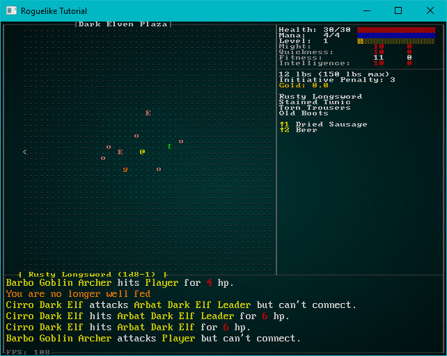
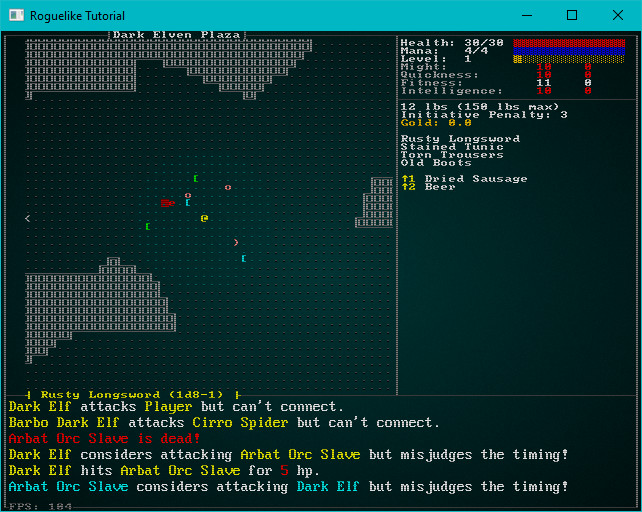
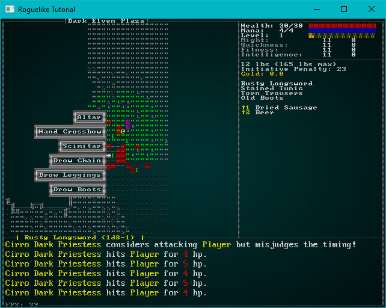
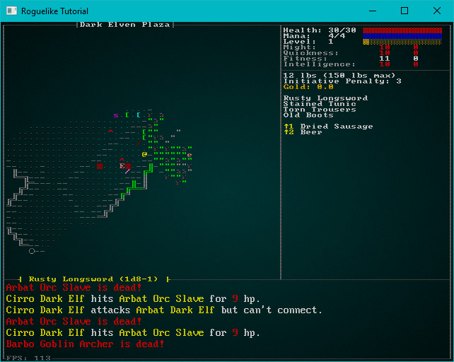
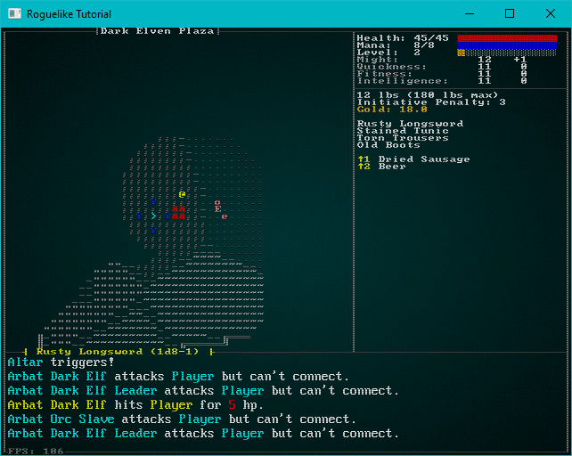

# One Night in the Plaza

---

***About this tutorial***

*This tutorial is free and open source, and all code uses the MIT license - so you are free to do with it as you like. My hope is that you will enjoy the tutorial, and make great games!*

*If you enjoy this and would like me to keep writing, please consider supporting [my Patreon](https://www.patreon.com/blackfuture).*

[](https://pragprog.com/titles/hwrust/hands-on-rust/)

---

The city level was deliberately messy: the hero is fighting through cramped, sprawling a Dark Elf under-city - facing different noble houses' troops who were also intent upon killing one another. It makes for fast-paced, tight combat. The last part of the city is the plaza - which is meant to offer more of a contrast. A park in the city holds a portal to the Abyss, and only the most affluent/influential dark elves can build here. So despite being underground, it's more of an outdoor city type of feeling.

So let's think a bit about what makes up the plaza level:

* A decent sized park, defended by some tough baddies. We can add something demonic here for the first time, since we're right next to a portal to their home.
* Some larger buildings.
* Statues, fountains and similar niceties.

Continuing to think about dark elves, they aren't really known for their civic planning. They are, at heart, a Chaotic species. So we want to avoid the feeling that they really planned out their city, and meticulously built it to make sense. In fact, not making sense adds to the surreality.

## Generating the Plaza

Just like we have for other level builders, we need to add a placeholder builder for level `11`. Open `map_builders/mod.rs` and add a call to `dark_elf_plaza` for level 11:

```rust
pub fn level_builder(new_depth: i32, width: i32, height: i32) -> BuilderChain {
    rltk::console::log(format!("Depth: {}", new_depth));
    match new_depth {
        1 => town_builder(new_depth, width, height),
        2 => forest_builder(new_depth, width, height),
        3 => limestone_cavern_builder(new_depth, width, height),
        4 => limestone_deep_cavern_builder(new_depth, width, height),
        5 => limestone_transition_builder(new_depth, width, height),
        6 => dwarf_fort_builder(new_depth, width, height),
        7 => mushroom_entrance(new_depth, width, height),
        8 => mushroom_builder(new_depth, width, height),
        9 => mushroom_exit(new_depth, width, height),
        10 => dark_elf_city(new_depth, width, height),
        11 => dark_elf_plaza(new_depth, width, height),
        _ => random_builder(new_depth, width, height)
    }
}
```

Now open `map_builders/dark_elves.rs` and create the new map builder function---`dark_elf_plaza`. We'll start with generating a BSP interior map; that'll change, but it's good to get something compiling:

```rust
pub fn dark_elf_plaza(new_depth: i32, width: i32, height: i32) -> BuilderChain {
    println!("Dark elf plaza builder");
    let mut chain = BuilderChain::new(new_depth, width, height, "Dark Elven Plaza");
    chain.start_with(BspInteriorBuilder::new());
    chain.with(AreaStartingPosition::new(XStart::LEFT, YStart::CENTER));
    chain.with(CullUnreachable::new());
    chain.with(AreaEndingPosition::new(XEnd::RIGHT, YEnd::CENTER));
    chain.with(VoronoiSpawning::new());
    chain
}
```

### Deliberately Poor City Planning

Now that we have the exact same map as the previous level, let's build a generator to create the plaza. We'll get started by making a boring, empty map - just to validate that our map builder is working. At the end of `dark_elves.rs`, paste in the following:

```rust
// Plaza Builder
use super::{InitialMapBuilder, BuilderMap, TileType };

pub struct PlazaMapBuilder {}

impl InitialMapBuilder for PlazaMapBuilder {
    #[allow(dead_code)]
    fn build_map(&mut self, build_data : &mut BuilderMap) {
        self.empty_map(build_data);
    }
}

impl PlazaMapBuilder {
    #[allow(dead_code)]
    pub fn new() -> Box<PlazaMapBuilder> {
        Box::new(PlazaMapBuilder{})
    }

    fn empty_map(&mut self, build_data : &mut BuilderMap) {
        build_data.map.tiles.iter_mut().for_each(|t| *t = TileType::Floor);
    }
}
```

You also need to go into the `dark_elf_plaza` and change the initial builder to use it:

```rust
pub fn dark_elf_plaza(new_depth: i32, width: i32, height: i32) -> BuilderChain {
    println!("Dark elf plaza builder");
    let mut chain = BuilderChain::new(new_depth, width, height, "Dark Elven Plaza");
    chain.start_with(PlazaMapBuilder::new());
    chain.with(AreaStartingPosition::new(XStart::LEFT, YStart::CENTER));
    chain.with(CullUnreachable::new());
    chain.with(AreaEndingPosition::new(XEnd::RIGHT, YEnd::CENTER));
    chain.with(VoronoiSpawning::new());
    chain
}
```

If you run the game now and teleport down to the last level, the "plaza" is a giant open space full of people killing both you and one another. I found it quite entertaining, but it's not what we want.



The plaza needs to be divided into zones, which contain plaza content. That's similar to what we did for Voronoi maps, but we aren't looking to create cellular walls - just areas in which to place content. Let's start by making a basic Voronoi cell area. Extend your map builder to call a new function named `spawn_zones`:

```rust
impl InitialMapBuilder for PlazaMapBuilder {
    #[allow(dead_code)]
    fn build_map(&mut self, build_data : &mut BuilderMap) {
        self.empty_map(build_data);
        self.spawn_zones(build_data);
    }
}
```

We'll start by taking our previous Voronoi code, and making it always have 32 seeds and use Pythagoras for distance:

```rust
fn spawn_zones(&mut self, build_data : &mut BuilderMap) {
    let mut voronoi_seeds : Vec<(usize, rltk::Point)> = Vec::new();

    while voronoi_seeds.len() < 32 {
        let vx = crate::rng::roll_dice(1, build_data.map.width-1);
        let vy = crate::rng::roll_dice(1, build_data.map.height-1);
        let vidx = build_data.map.xy_idx(vx, vy);
        let candidate = (vidx, rltk::Point::new(vx, vy));
        if !voronoi_seeds.contains(&candidate) {
            voronoi_seeds.push(candidate);
        }
    }

    let mut voronoi_distance = vec![(0, 0.0f32) ; 32];
    let mut voronoi_membership : Vec<i32> = vec![0 ; build_data.map.width as usize * build_data.map.height as usize];
    for (i, vid) in voronoi_membership.iter_mut().enumerate() {
        let x = i as i32 % build_data.map.width;
        let y = i as i32 / build_data.map.width;

        for (seed, pos) in voronoi_seeds.iter().enumerate() {
            let distance = rltk::DistanceAlg::PythagorasSquared.distance2d(
                rltk::Point::new(x, y),
                pos.1
            );
            voronoi_distance[seed] = (seed, distance);
        }

        voronoi_distance.sort_by(|a,b| a.1.partial_cmp(&b.1).unwrap());

        *vid = voronoi_distance[0].0 as i32;
    }

    // Spawning code will go here
}
```

At the end of the new `spawn_zones` function, we have an array named `voronoi_membership` that categorizes every tile into one of 32 zones. The zones are guaranteed to be contiguous. Let's write some quick code to count the sizes of each zone to validate our work:

```rust
// Make a list of zone sizes and cull empty ones
let mut zone_sizes : Vec<(i32, usize)> = Vec::with_capacity(32);
for zone in 0..32 {
    let num_tiles = voronoi_membership.iter().filter(|z| **z == zone).count();
    if num_tiles > 0 {
        zone_sizes.push((zone, num_tiles));
    }
}
println!("{:?}", zone_sizes);
```

This will give different results every time, but will give a good idea of how many zones we've created and how large they are. Here's the output from a quick test run:

```
[(0, 88), (1, 60), (2, 143), (3, 261), (4, 192), (5, 165), (6, 271), (7, 68), (8, 151), (9, 78), (10, 45), (11, 154), (12, 132), (13, 88), (14, 162), (15, 49), (16, 138), (17, 57), (18, 206), (19, 117), (20, 168), (21, 67), (22, 153), (23, 119), (24, 41), (25, 48), (26, 78), (27, 118), (28, 197), (29, 129), (30, 163), (31, 94)]
```

So we know that the zone creation works: there are 32 zones, none of which are excessively tiny - although some are quite large. Let's sort the list by size, descending:

```rust
zone_sizes.sort_by(|a,b| b.1.cmp(&a.1));
```

This yields a weighted "importance" map: the big zones are first, the smaller zones last. We'll use this to spawn content in order of importance. The big "portal park" is guaranteed to be the largest area. Here's the start of our creation system:

```rust
// Start making zonal terrain
zone_sizes.iter().enumerate().for_each(|(i, (zone, _))| {
    match i {
        0 => self.portal_park(build_data, &voronoi_membership, *zone),
        _ => {}
    }
});
```

The placeholder signature for `portal_park` is as follows:

```rust
fn portal_park(&mut self, build_data : &mut BuilderMap, voronoi_membership: &[i32], zone: i32) {
}
```

We'll use this pattern to gradually populate the plaza. For now, we'll skip the portal park and add some other features first.

### Solid Rock

Let's start with the simplest: we're going to turn some of the smaller zones into solid rock. These might be areas the elves haven't mined yet, or - more likely - they left them in place to hold the cavern up. We're going to use a feature we haven't touched before: a "match guard". You can make `match` work for "greater than" as follows:

```rust
// Start making zonal terrain
zone_sizes.iter().enumerate().for_each(|(i, (zone, _))| {
    match i {
        0 => self.portal_park(build_data, &voronoi_membership, *zone),
        i if i > 20 => self.fill_zone(build_data, &voronoi_membership, *zone, TileType::Wall),
        _ => {}
    }
});
```

The actual `fill_zone` function is quite simple: it finds tiles in the zone and turns them into walls:

```rust
fn fill_zone(&mut self, build_data : &mut BuilderMap, voronoi_membership: &[i32], zone: i32, tile_type: TileType) {
        voronoi_membership
            .iter()
            .enumerate()
            .filter(|(_, tile_zone)| **tile_zone == zone)
            .for_each(|(idx, _)| build_data.map.tiles[idx] = tile_type);
    }
```

This already injects a little life into our map:



### Pools

Caves tend to be dank, wet places. The dark elves probably enjoy a few pools - plazas are known for magnificent pools! Let's extend the "default" matching to sometimes create zone pools:

```rust
// Start making zonal terrain
zone_sizes.iter().enumerate().for_each(|(i, (zone, _))| {
    match i {
        0 => self.portal_park(build_data, &voronoi_membership, *zone),
        i if i > 20 => self.fill_zone(build_data, &voronoi_membership, *zone, TileType::Wall),
        _ => {
            let roll = crate::rng::roll_dice(1, 6);
            match roll {
                1 => self.fill_zone(build_data, &voronoi_membership, *zone, TileType::DeepWater),
                2 => self.fill_zone(build_data, &voronoi_membership, *zone, TileType::ShallowWater),
                _ => {}
            }
        }
    }
});
```
See how if we aren't matching anything else, we roll a dice? If it comes up 1 or 2, we add a pool of varying depth. Actually adding the pool is just like adding solid rock - but we add water instead.

The addition of some water features continues to bring the zone to life:


### Stalactite Parks

Stalactites (and presumably their twin, stalagmites) can be a beautiful feature of real caves. They are a natural candidate for inclusion in a dark elf park. It would be nice to have a bit of color in the city, so let's surround them with grass. They are a carefully cultivated park, offering privacy for whatever dark elves do in their spare time (you don't want to know...).

Add it to the "unknown" zone options:

```rust
// Start making zonal terrain
zone_sizes.iter().enumerate().for_each(|(i, (zone, _))| {
    match i {
        0 => self.portal_park(build_data, &voronoi_membership, *zone),
        i if i > 20 => self.fill_zone(build_data, &voronoi_membership, *zone, TileType::Wall),
        _ => {
            let roll = crate::rng::roll_dice(1, 6);
            match roll {
                1 => self.fill_zone(build_data, &voronoi_membership, *zone, TileType::DeepWater),
                2 => self.fill_zone(build_data, &voronoi_membership, *zone, TileType::ShallowWater),
                3 => self.stalactite_display(build_data, &voronoi_membership, *zone),
                _ => {}
            }
        }
    }
});
```

And use a similar function to `fill_zone` to populate each tile in the zone with either grass or a stalactite:

```rust
fn stalactite_display(&mut self, build_data : &mut BuilderMap, voronoi_membership: &[i32], zone: i32) {
        voronoi_membership
            .iter()
            .enumerate()
            .filter(|(_, tile_zone)| **tile_zone == zone)
            .for_each(|(idx, _)| {
                build_data.map.tiles[idx] = match crate::rng::roll_dice(1,10) {
                    1 => TileType::Stalactite,
                    2 => TileType::Stalagmite,
                    _ => TileType::Grass,
                };
            });
    }
```

### Parks & Sacrifice Areas

A few areas of vegetative cover, with seating adds to the park feel. These should be larger areas - that's the dominant theme of the zone. I don't really picture dark elves sitting around listening to a nice concert---so let's go with an altar in the middle, complete with bloodstains. Notice how we're using an "or" statement in our `match` to match both the 2nd and 3rd largest zones:

```rust
// Start making zonal terrain
zone_sizes.iter().enumerate().for_each(|(i, (zone, _))| {
    match i {
        0 => self.portal_park(build_data, &voronoi_membership, *zone),
        1 | 2 => self.park(build_data, &voronoi_membership, *zone),
        i if i > 20 => self.fill_zone(build_data, &voronoi_membership, *zone, TileType::Wall),
        _ => {
            let roll = crate::rng::roll_dice(1, 6);
            match roll {
                1 => self.fill_zone(build_data, &voronoi_membership, *zone, TileType::DeepWater),
                2 => self.fill_zone(build_data, &voronoi_membership, *zone, TileType::ShallowWater),
                3 => self.stalactite_display(build_data, &voronoi_membership, *zone),
                _ => {}
            }
        }
    }
});
```

Actually populating the park is slightly more convoluted:

```rust
fn park(&mut self, build_data : &mut BuilderMap, voronoi_membership: &[i32], zone: i32, seeds: &[(usize, rltk::Point)]) {
    let zone_tiles : Vec<usize> = voronoi_membership
        .iter()
        .enumerate()
        .filter(|(_, tile_zone)| **tile_zone == zone)
        .map(|(idx, _)| idx)
        .collect();

    // Start all grass
    zone_tiles.iter().for_each(|idx| build_data.map.tiles[*idx] = TileType::Grass);

    // Add a stone area in the middle
    let center = seeds[zone as usize].1;
    for y in center.y-2 ..= center.y+2 {
        for x in center.x-2 ..= center.x+2 {
            let idx = build_data.map.xy_idx(x, y);
            build_data.map.tiles[idx] = TileType::Road;
            if crate::rng::roll_dice(1,6) > 2 {
                build_data.map.bloodstains.insert(idx);
            }
        }
    }

    // With an altar at the center
    build_data.spawn_list.push((
        build_data.map.xy_idx(center.x, center.y),
        "Altar".to_string()
    ));

    // And chairs for spectators
    zone_tiles.iter().for_each(|idx| {
        if build_data.map.tiles[*idx] == TileType::Grass && crate::rng::roll_dice(1, 6)==1 {
            build_data.spawn_list.push((
                *idx,
                "Chair".to_string()
            ));
        }
    });
}
```

We start by collecting a list of available tiles. Then we cover them all in nice grass. Find the center point of the Voronoi zone (it'll be the seed that generated it), and cover that area with road. Spawn an altar in the middle, some random blood stains and a bunch of chairs. It's all spawning we've done before - but pulled together to make a (not entirely pleasant) theme park.

The park areas look sufficiently chaotic:



### Adding Walkways

At this point, there's no guaranty that you can actually traverse the map. It's entirely possible that water and walls will coincide in just the wrong way to block your progress. That's not a good thing! Let's use the system we encountered when we created the first Voronoi builder to identify edges between voronoi zones---and replace the edge tiles with roads. This ensures that there's a pathway between zones, as well as giving a nice honeycomb effect across the map.

Start by adding a call to the end of `spawn_zones` that calls the road builder:

```rust
// Clear the path
self.make_roads(build_data, &voronoi_membership);
```

Now we actually have to build some roads. Most of this code is the same as the voronoi edge detection. Instead of placing floors inside the zone, we're placing roads on the edge:

```rust
fn make_roads(&mut self, build_data : &mut BuilderMap, voronoi_membership: &[i32]) {
    for y in 1..build_data.map.height-1 {
        for x in 1..build_data.map.width-1 {
            let mut neighbors = 0;
            let my_idx = build_data.map.xy_idx(x, y);
            let my_seed = voronoi_membership[my_idx];
            if voronoi_membership[build_data.map.xy_idx(x-1, y)] != my_seed { neighbors += 1; }
            if voronoi_membership[build_data.map.xy_idx(x+1, y)] != my_seed { neighbors += 1; }
            if voronoi_membership[build_data.map.xy_idx(x, y-1)] != my_seed { neighbors += 1; }
            if voronoi_membership[build_data.map.xy_idx(x, y+1)] != my_seed { neighbors += 1; }

            if neighbors > 1 {
                build_data.map.tiles[my_idx] = TileType::Road;
            }
        }
    }
}
```

With this in place, the map is passable. Roads delineate the edges, without looking too square:



### Cleaning up the Spawns

Currently, the map is *very* chaotic --- and quite likely to kill you very fast. There's big open areas, chock full of baddies, traps (why would you build a trap in a park?), and items strewn around. Chaos is good, but there's such a thing as too much randomness. We'd like to have the map make some sense---in a random sort of way.

Let's start by completely removing the random entity spawner from the builder chain:

```rust
pub fn dark_elf_plaza(new_depth: i32, width: i32, height: i32) -> BuilderChain {
    println!("Dark elf plaza builder");
    let mut chain = BuilderChain::new(new_depth, width, height, "Dark Elven Plaza");
    chain.start_with(PlazaMapBuilder::new());
    chain.with(AreaStartingPosition::new(XStart::LEFT, YStart::CENTER));
    chain.with(CullUnreachable::new());
    chain.with(AreaEndingPosition::new(XEnd::RIGHT, YEnd::CENTER));
    chain
}
```

This gives you an enemy-free map, albeit one that still has some chairs and altars. This is a "theme park" map - so we're going to retain some control over what spawns in a given area. It will be light on assistance to the player---we're nearly at the end, so hopefully they stocked up!

Let's start by putting some monsters in the park/altar areas. One dark elf family or the other is there, leading to clusters of enemies. Now find the `park` function, and we'll extend the "add chairs" section:

```rust
// And chairs for spectators, and the spectators themselves
let available_enemies = match crate::rng::roll_dice(1, 3) {
    1 => vec![
        "Arbat Dark Elf",
        "Arbat Dark Elf Leader",
        "Arbat Orc Slave",
    ],
    2 => vec![
        "Barbo Dark Elf",
        "Barbo Goblin Archer",
    ],
    _ => vec![
        "Cirro Dark Elf",
        "Cirro Dark Priestess",
        "Cirro Spider",
    ]
};

zone_tiles.iter().for_each(|idx| {
    if build_data.map.tiles[*idx] == TileType::Grass {
            match crate::rng::roll_dice(1, 10) {
            1 => build_data.spawn_list.push((
                    *idx,
                    "Chair".to_string()
                )),
            2 => {
                let to_spawn = crate::rng::range(0, available_enemies.len() as i32);
                build_data.spawn_list.push((
                    *idx,
                    available_enemies[to_spawn as usize].to_string()
                ));
            }
            _ => {}
        }
    }
});
```

We're doing a couple of new things here. We're randomly assigning an owner to the park - A, B or C groups of Dark Elves. Then we make a list of available spawns for each, and spawn a few in that park. This ensures that the park *starts* as owned by one faction. Since they can often see one another, carnage will commence - but at least it's themed carnage.

We're going to leave the stalactite galleries and pools empty of enemies. They are just window dressing, and provide a quiet area to hide/rest (see? We're not being totally unfair!).

### The Portal Park

Now that we've got the basic shape of the map down, it's time to focus on the park. The first thing to do is to stop the exit from spawning randomly. Change the basic map builder to not include exit placement:

```rust
pub fn dark_elf_plaza(new_depth: i32, width: i32, height: i32) -> BuilderChain {
    println!("Dark elf plaza builder");
    let mut chain = BuilderChain::new(new_depth, width, height, "Dark Elven Plaza");
    chain.start_with(PlazaMapBuilder::new());
    chain.with(AreaStartingPosition::new(XStart::LEFT, YStart::CENTER));
    chain.with(CullUnreachable::new());
    chain
}
```

That leaves you with no exit at all. We want to place it in the middle of Portal Park. Let's extend the function signature to include the voronoi seeds, and use the seed point to place the exit---just like we did for other parks:

```rust
fn portal_park(&mut self, build_data : &mut BuilderMap, voronoi_membership: &[i32], zone: i32, seeds: &[(usize, rltk::Point)]) {
    let center = seeds[zone as usize].1;
    let idx = build_data.map.xy_idx(center.x, center.y);
    build_data.map.tiles[idx] = TileType::DownStairs;
}
```

Now, let's make the portal park stand out a bit by covering it in gravel:

```rust
fn portal_park(&mut self, build_data : &mut BuilderMap, voronoi_membership: &[i32], zone: i32, seeds: &[(usize, rltk::Point)]) {
    let zone_tiles : Vec<usize> = voronoi_membership
        .iter()
        .enumerate()
        .filter(|(_, tile_zone)| **tile_zone == zone)
        .map(|(idx, _)| idx)
        .collect();

    // Start all gravel
    zone_tiles.iter().for_each(|idx| build_data.map.tiles[*idx] = TileType::Gravel);

    // Add the exit
    let center = seeds[zone as usize].1;
    let idx = build_data.map.xy_idx(center.x, center.y);
    build_data.map.tiles[idx] = TileType::DownStairs;
}
```

Next, we'll add some altars around the exit:

```rust
// Add some altars around the exit
let altars = [
    build_data.map.xy_idx(center.x - 2, center.y),
    build_data.map.xy_idx(center.x + 2, center.y),
    build_data.map.xy_idx(center.x, center.y - 2),
    build_data.map.xy_idx(center.x, center.y + 2),
];
altars.iter().for_each(|idx| build_data.spawn_list.push((*idx, "Altar".to_string())));
```

This gives a pretty good start at the exit to Abyss. You have the exit in the right place, creepy altars and a clearly marked approach. It's also devoid of risk (other than the elves killing one another all over the map).

Let's make the exit a little more challenging by adding a boss fight to the exit. It's the last big push before Abyss, so it's a natural spot for it. I randomly generated a demon name, and decided to name the boss "Vokoth". Let's spawn it one tile adjacent to th exit:

```rust
let demon_spawn = build_data.map.xy_idx(center.x+1, center.y+1);
build_data.spawn_list.push((demon_spawn, "Vokoth".to_string()));
```

This won't do anything at all until we define Vokoth! We want a tough baddie. Let's take a quick trip down memory lane in `spawns.json` and remind ourselves how we defined the black dragon:

```json
{
    "name" : "Black Dragon",
    "renderable": {
        "glyph" : "D",
        "fg" : "#FF0000",
        "bg" : "#000000",
        "order" : 1,
        "x_size" : 2,
        "y_size" : 2
    },
    "blocks_tile" : true,
    "vision_range" : 12,
    "movement" : "static",
    "attributes" : {
        "might" : 13,
        "fitness" : 13
    },
    "skills" : {
        "Melee" : 18,
        "Defense" : 16
    },
    "natural" : {
        "armor_class" : 17,
        "attacks" : [
            { "name" : "bite", "hit_bonus" : 4, "damage" : "1d10+2" },
            { "name" : "left_claw", "hit_bonus" : 2, "damage" : "1d10" },
            { "name" : "right_claw", "hit_bonus" : 2, "damage" : "1d10" }
        ]
    },
    "loot_table" : "Wyrms",
    "faction" : "Wyrm",
    "level" : 6,
    "gold" : "20d10",
    "abilities" : [
        { "spell" : "Acid Breath", "chance" : 0.2, "range" : 8.0, "min_range" : 2.0 }
    ]
},
```

That's a really tough monster, and makes for a good template for the Abyssal demon. Let's clone it (copy/paste time!) and build an entry for Vokoth:

```json
{
    "name" : "Vokoth",
    "renderable": {
        "glyph" : "&",
        "fg" : "#FF0000",
        "bg" : "#000000",
        "order" : 1,
        "x_size" : 2,
        "y_size" : 2
    },
    "blocks_tile" : true,
    "vision_range" : 6,
    "movement" : "static",
    "attributes" : {
        "might" : 13,
        "fitness" : 13
    },
    "skills" : {
        "Melee" : 18,
        "Defense" : 16
    },
    "natural" : {
        "armor_class" : 17,
        "attacks" : [
            { "name" : "whip", "hit_bonus" : 4, "damage" : "1d10+2" }
        ]
    },
    "loot_table" : "Wyrms",
    "faction" : "Wyrm",
    "level" : 8,
    "gold" : "20d10",
    "abilities" : []
}
```

Now if you play the game, you'll find yourself facing a nasty demon monster at the exit to Abyss.



## Wrap-Up

We now have the second-to-last section done! You can battle your way down to the Dark Elf Plaza, and find the gateway to Abyss - but only if you can evade a hulking demon and a horde of elves---with very little in the way of help offered. Next up, we'll begin to build the Abyss.

---

**The source code for this chapter may be found [here](https://github.com/thebracket/rustrogueliketutorial/tree/master/chapter-75-darkplaza)**


[Run this chapter's example with web assembly, in your browser (WebGL2 required)](https://bfnightly.bracketproductions.com/rustbook/wasm/chapter-75-darkplaza)
---

Copyright (C) 2019, Herbert Wolverson.

---