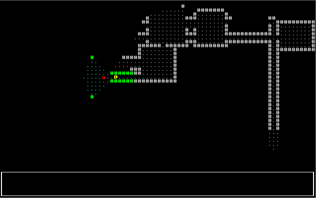
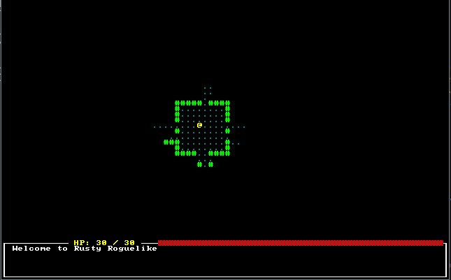
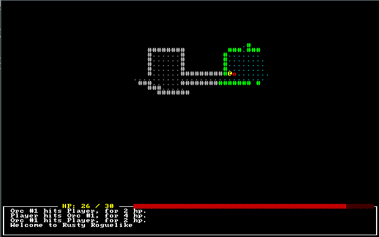
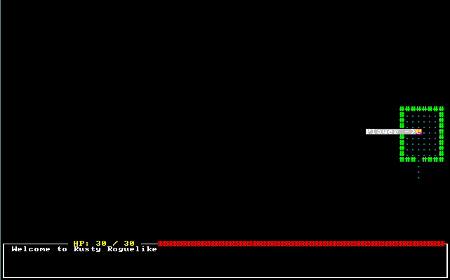

# User Interface

---

***About this tutorial***

*This tutorial is free and open source, and all code uses the MIT license - so you are free to do with it as you like. My hope is that you will enjoy the tutorial, and make great games!*

*If you enjoy this and would like me to keep writing, please consider supporting [my Patreon](https://www.patreon.com/blackfuture).*

---

In this chapter, we'll add a user interface to the game.

# Shrinking the map

We'll start off by going to `map.rs`, and adding some constants: `MAPWIDTH`, `MAPHEIGHT` and `MAPCOUNT`:
```rust
const MAPWIDTH : usize = 80;
const MAPHEIGHT : usize = 50;
const MAPCOUNT : usize = MAPHEIGHT * MAPWIDTH;
```

Then we'll go through and change every reference to 80*50 to `MAPCOUNT`, and references to the map size to use the constants. When this is done and running, we'll change the `MAPHEIGHT` to 43 - to give us room at the bottom of the screen for a user interface panel.

# Some minimal GUI elements

We'll create a new file, `gui.rs` to hold our code. We'll go with a really minimal start:

```rust
extern crate rltk;
use rltk::{ RGB, Rltk, Console };
extern crate specs;
use specs::prelude::*;

pub fn draw_ui(ecs: &World, ctx : &mut Rltk) {
    ctx.draw_box(0, 43, 79, 6, RGB::named(rltk::WHITE), RGB::named(rltk::BLACK));
}
```

We add a `mod gui` to the import block at the top of `main.rs`, and call it at the end of `tick`:
```rust
gui::draw_ui(&self.ecs, ctx);
```

If we `cargo run` now, we'll see that the map has shrunk - and we have a white box in place for the panel.



# Adding a health bar

It would help the player out to know how much health they have left. Fortunately, RLTK provides a convenient helper for this. We'll need to obtain the player's health from the ECS, and render it. This is pretty easy, and you should be comfortable with it by now. The code looks like this:

```rust
extern crate rltk;
use rltk::{ RGB, Rltk, Console };
extern crate specs;
use specs::prelude::*;
use super::{CombatStats, Player};

pub fn draw_ui(ecs: &World, ctx : &mut Rltk) {
    ctx.draw_box(0, 43, 79, 6, RGB::named(rltk::WHITE), RGB::named(rltk::BLACK));

    let combat_stats = ecs.read_storage::<CombatStats>();
    let players = ecs.read_storage::<Player>();
    for (_player, stats) in (&players, &combat_stats).join() {
        let health = format!(" HP: {} / {} ", stats.hp, stats.max_hp);
        ctx.print_color(12, 43, RGB::named(rltk::YELLOW), RGB::named(rltk::BLACK), &health);

        ctx.draw_bar_horizontal(28, 43, 51, stats.hp, stats.max_hp, RGB::named(rltk::RED), RGB::named(rltk::BLACK));
    }
}
```

# Adding a message log

The game log makes sense as a *resource*: it's available to any system that wants to tell you something, and there's very little restriction as to what might want to tell you something. We'll start by modelling the log itself. Make a new file, `gamelog.rs`. We'll start very simply:

```rust
pub struct GameLog {
    pub entries : Vec<String>
}
```

In `main.rs` we add a `mod gamelog;` line, and insert it as a resource with `gs.ecs.insert(gamelog::GameLog{ entries : vec!["Welcome to Rusty Roguelike".to_string()] });`. We're inserting a line into the log file at the start, using the `vec!` macro for constructing vectors. That gives us something to display - so we'll start writing the log display code in `gui.rs`. In our GUI drawing function, we simply add:

```rust
let log = ecs.fetch::<GameLog>();

let mut y = 44;
for s in log.entries.iter() {
    if y < 49 { ctx.print(2, y, &s.to_string()); }
    y += 1;
}
```

If you `cargo run` the project now, you'll see something like this:



# Logging attacks

In our `melee_combat_system`, we add `gamelog::GameLog` to our imports from `super`, add a read/write accessor for the log (`WriteExpect<'a, GameLog>,`), and extend the destructuring to include it: `let (entities, mut log, mut wants_melee, names, combat_stats, mut inflict_damage) = data;`. Then it's just a matter of replacing the `print!` macros with inserting into the game log. Here's the resultant code:

```rust
extern crate specs;
use specs::prelude::*;
use super::{CombatStats, WantsToMelee, Name, SufferDamage, gamelog::GameLog};

pub struct MeleeCombatSystem {}

impl<'a> System<'a> for MeleeCombatSystem {
    #[allow(clippy::type_complexity)]
    type SystemData = ( Entities<'a>,
                        WriteExpect<'a, GameLog>,
                        WriteStorage<'a, WantsToMelee>,
                        ReadStorage<'a, Name>,
                        ReadStorage<'a, CombatStats>,
                        WriteStorage<'a, SufferDamage>
                      );

    fn run(&mut self, data : Self::SystemData) {
        let (entities, mut log, mut wants_melee, names, combat_stats, mut inflict_damage) = data;

        for (_entity, wants_melee, name, stats) in (&entities, &wants_melee, &names, &combat_stats).join() {
            if stats.hp > 0 {
                let target_stats = combat_stats.get(wants_melee.target).unwrap();
                if target_stats.hp > 0 {
                    let target_name = names.get(wants_melee.target).unwrap();

                    let damage = i32::max(0, stats.power - target_stats.defense);

                    if damage == 0 {
                        log.entries.insert(0, format!("{} is unable to hurt {}", &name.name, &target_name.name));
                    } else {
                        log.entries.insert(0, format!("{} hits {}, for {} hp.", &name.name, &target_name.name, damage));
                        inflict_damage.insert(wants_melee.target, SufferDamage{ amount: damage }).expect("Unable to do damage");                        
                    }
                }
            }
        }

        wants_melee.clear();
    }
}
```

Now if you run the game and play a bit (`cargo run`, playing is up to you!), you'll see combat messages in the log:



# Notifying of deaths

We can do the same thing with `delete_the_dead` to notify of deaths. Here's the finished code:

```rust
pub fn delete_the_dead(ecs : &mut World) {
    let mut dead : Vec<Entity> = Vec::new();
    // Using a scope to make the borrow checker happy
    {
        let combat_stats = ecs.read_storage::<CombatStats>();
        let players = ecs.read_storage::<Player>();
        let names = ecs.read_storage::<Name>();
        let entities = ecs.entities();
        let mut log = ecs.write_resource::<GameLog>();
        for (entity, stats) in (&entities, &combat_stats).join() {
            if stats.hp < 1 { 
                let player = players.get(entity);
                match player {
                    None => {
                        let victim_name = names.get(entity);
                        if let Some(victim_name) = victim_name {
                            log.entries.insert(0, format!("{} is dead", &victim_name.name));
                        }
                        dead.push(entity)
                    }
                    Some(_) => println!("You are dead")
                }
            }
        }
    }

    for victim in dead {
        ecs.delete_entity(victim).expect("Unable to delete");
    }    
}
```

# Mouse Support and Tooltips

Let's start by looking at how we obtain mouse information from RLTK. It's really easy; add the following at the bottom of your `draw_ui` function:

```rust
// Draw mouse cursor
let mouse_pos = ctx.mouse_pos();
ctx.set_bg(mouse_pos.0, mouse_pos.1, RGB::named(rltk::MAGENTA));
```

This sets the background of the cell at which the mouse is pointed to magenta. As you can see, mouse information arrives from RLTK as part of the context.

Now we'll introduce a new function, `draw_tooltips` and call it at the end of `draw_ui`. New new function looks like this:

```rust
fn draw_tooltips(ecs: &World, ctx : &mut Rltk) {
    let map = ecs.fetch::<Map>();
    let names = ecs.read_storage::<Name>();
    let positions = ecs.read_storage::<Position>();

    let mouse_pos = ctx.mouse_pos();
    if mouse_pos.0 >= map.width || mouse_pos.1 >= map.height { return; }
    let mut tooltip : Vec<String> = Vec::new();
    for (name, position) in (&names, &positions).join() {
        if position.x == mouse_pos.0 && position.y == mouse_pos.1 {
            tooltip.push(name.name.to_string());
        }
    }

    if !tooltip.is_empty() {
        let mut width :i32 = 0;
        for s in tooltip.iter() {
            if width < s.len() as i32 { width = s.len() as i32; }
        }
        width += 3;

        if mouse_pos.0 > 40 {
            let arrow_pos = Point::new(mouse_pos.0 - 2, mouse_pos.1);
            let left_x = mouse_pos.0 - width;
            let mut y = mouse_pos.1;
            for s in tooltip.iter() {
                ctx.print_color(left_x, y, RGB::named(rltk::WHITE), RGB::named(rltk::GREY), &s.to_string());
                let padding = (width - s.len() as i32)-1;
                for i in 0..padding {
                    ctx.print_color(arrow_pos.x - i, y, RGB::named(rltk::WHITE), RGB::named(rltk::GREY), &" ".to_string());
                }
                y += 1;
            }
            ctx.print_color(arrow_pos.x, arrow_pos.y, RGB::named(rltk::WHITE), RGB::named(rltk::GREY), &"->".to_string());
        } else {
            let arrow_pos = Point::new(mouse_pos.0 + 1, mouse_pos.1);
            let left_x = mouse_pos.0 +3;
            let mut y = mouse_pos.1;
            for s in tooltip.iter() {
                ctx.print_color(left_x, y, RGB::named(rltk::WHITE), RGB::named(rltk::GREY), &s.to_string());
                let padding = (width - s.len() as i32)-1;
                for i in 0..padding {
                    ctx.print_color(left_x + s.len() as i32 + i, y, RGB::named(rltk::WHITE), RGB::named(rltk::GREY), &" ".to_string());
                }
                y += 1;
            }
            ctx.print_color(arrow_pos.x, arrow_pos.y, RGB::named(rltk::WHITE), RGB::named(rltk::GREY), &"<-".to_string());
        }
    }
}
```

It starts by obtaining read access to the components we need for tooltips: names and positions. It also gets read access to the map itself. Then we check that mouse cursor is actually *on* the map, and bail out if it isn't - no point in trying to draw tooltips for something that can never have any!

The remainder says "if we have any tooltips, look at the mouse position" - if its on the left, we'll put the tooltip to the right, otherwise to the left.

If you `cargo run` your project now, it looks like this:



# Optional post-processing for that truly retro feeling

Since we're on look and feel, lets consider enabling an RLTK feature: post-processing to give scanlines and screen burn, for that truly retro feel. It's entirely up to you if you want to use this! In `main.rs`, the initial setup simply replaced the first `init` command with:

```rust
let mut context = Rltk::init_simple8x8(80, 50, "Hello Rust World", "../resources");
context.with_post_scanlines(true);
```

If you choose to do this, the game looks a bit like the classic *Caves of Qud*:


# Wrap up

Now that we have a GUI, it's starting to look pretty good!

**The source code for this chapter may be found [here](https://github.com/thebracket/rustrogueliketutorial/tree/master/chapter-08-ui)**

---

Copyright (C) 2019, Herbert Wolverson.

---