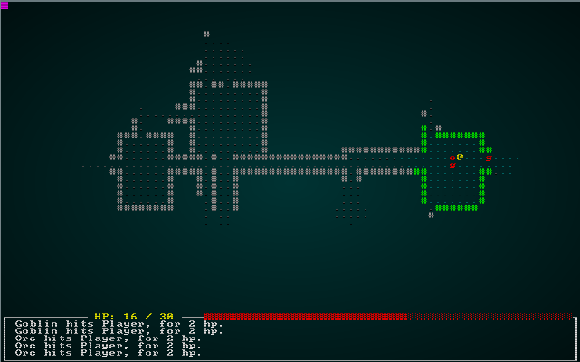
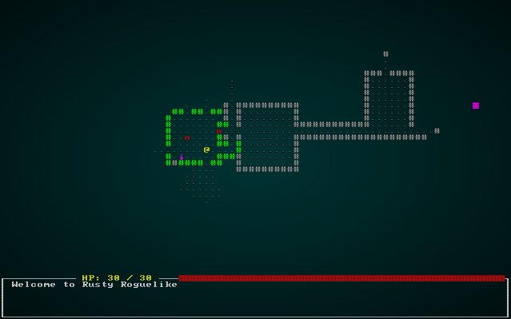
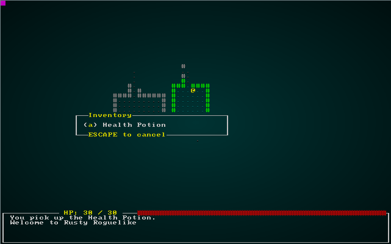
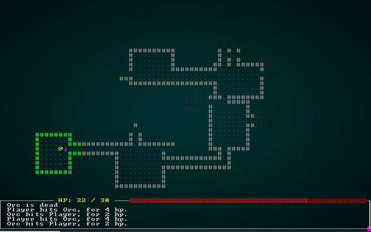
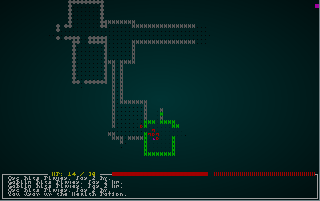

# Items and Inventory

---

***About this tutorial***

*This tutorial is free and open source, and all code uses the MIT license - so you are free to do with it as you like. My hope is that you will enjoy the tutorial, and make great games!*

*If you enjoy this and would like me to keep writing, please consider supporting [my Patreon](https://www.patreon.com/blackfuture).*

[](https://pragprog.com/titles/hwrust/hands-on-rust/)

---

So far, we have maps, monsters, and bashing things! No roguelike "murder hobo" experience would be complete without items to pick up along the way. This chapter will add some basic items to the game, along with User Interface elements required to pick them up, use them and drop them.

# Thinking about composing items

A major difference between object-oriented and entity-component systems is that rather than thinking about something as being located on an inheritance tree, you think about how it *composes* from components. Ideally, you already have some of the components ready to use!

So... what makes up an item? Thinking about it, an item can be said to have the following properties:

* It has a `Renderable` - a way to draw it.
* If its on the ground, awaiting pickup - it has a `Position`.
* If its NOT on the ground - say in a backpack, it needs a way to indicate that it it is stored. We'll start with `InPack`
* It's an `item`, which implies that it can be picked up. So it'll need an `Item` component of some sort.
* If it can be used, it will need some way to indicate that it *can* be used - and what to do with it.

# Consistently random

Computers are actually really bad at random numbers. Computers are inherently deterministic - so (without getting into cryptographic stuff) when you ask for a "random" number, you are actually getting a "really hard to predict next number in a sequence". The sequence is controlled by a *seed* - with the same seed, you always get the same dice rolls!

Since we have an ever-increasing number of things that use randomness, lets go ahead and make the RNG (Random Number Generator) a resource.

In `main.rs`, we add:

```rust
gs.ecs.insert(rltk::RandomNumberGenerator::new());
```

We can now access the RNG whenever we need it, without having to pass one around. Since we're not creating a new one, we can start it with a seed (we'd use `seeded` instead of `new`, and provide a seed). We'll worry about that later; for now, it's just going to make our code cleaner!

# Improved Spawning

One monster per room, always in the middle, makes for rather boring play. We also need to support spawning items as well as monsters!

To that end, we're going to make a new file `spawner.rs`:

```rust
use rltk::{ RGB, RandomNumberGenerator };
use specs::prelude::*;
use super::{CombatStats, Player, Renderable, Name, Position, Viewshed, Monster, BlocksTile};

/// Spawns the player and returns his/her entity object.
pub fn player(ecs : &mut World, player_x : i32, player_y : i32) -> Entity {
    ecs
        .create_entity()
        .with(Position { x: player_x, y: player_y })
        .with(Renderable {
            glyph: rltk::to_cp437('@'),
            fg: RGB::named(rltk::YELLOW),
            bg: RGB::named(rltk::BLACK),
        })
        .with(Player{})
        .with(Viewshed{ visible_tiles : Vec::new(), range: 8, dirty: true })
        .with(Name{name: "Player".to_string() })
        .with(CombatStats{ max_hp: 30, hp: 30, defense: 2, power: 5 })
        .build()
}

/// Spawns a random monster at a given location
pub fn random_monster(ecs: &mut World, x: i32, y: i32) {
    let roll :i32;
    {
        let mut rng = ecs.write_resource::<RandomNumberGenerator>();
        roll = rng.roll_dice(1, 2);
    }
    match roll {
        1 => { orc(ecs, x, y) }
        _ => { goblin(ecs, x, y) }
    }
}

fn orc(ecs: &mut World, x: i32, y: i32) { monster(ecs, x, y, rltk::to_cp437('o'), "Orc"); }
fn goblin(ecs: &mut World, x: i32, y: i32) { monster(ecs, x, y, rltk::to_cp437('g'), "Goblin"); }

fn monster<S : ToString>(ecs: &mut World, x: i32, y: i32, glyph : rltk::FontCharType, name : S) {
    ecs.create_entity()
        .with(Position{ x, y })
        .with(Renderable{
            glyph,
            fg: RGB::named(rltk::RED),
            bg: RGB::named(rltk::BLACK),
        })
        .with(Viewshed{ visible_tiles : Vec::new(), range: 8, dirty: true })
        .with(Monster{})
        .with(Name{ name : name.to_string() })
        .with(BlocksTile{})
        .with(CombatStats{ max_hp: 16, hp: 16, defense: 1, power: 4 })
        .build();
}
```

As you can see, we've taken the existing code in `main.rs` - and wrapped it up in functions in a different module. We don't *have* to do this - but it helps keep things tidy. Since we're going to be expanding our spawning, it's nice to keep things separated out. Now we modify `main.rs` to use it:

```rust
let player_entity = spawner::player(&mut gs.ecs, player_x, player_y);

gs.ecs.insert(rltk::RandomNumberGenerator::new());
for room in map.rooms.iter().skip(1) {
    let (x,y) = room.center();
    spawner::random_monster(&mut gs.ecs, x, y);
}
```

That's definitely tidier! `cargo run` will give you exactly what we had at the end of the previous chapter.

# Spawn All The Things

We're going to extend the function to spawn multiple monsters per room, with 0 being an option. First we change the Map constants which we introduced in the previous chapter to be public in order to use them in `spawner.rs`:

```rust
pub const MAPWIDTH : usize = 80;
pub const MAPHEIGHT : usize = 43;
pub const MAPCOUNT : usize = MAPHEIGHT * MAPWIDTH;
```

We want to control how many things we spawn, monsters and items. We'd like more monsters than items, to avoid too much of a "Monty Haul" dungeon! Also in `spawner.rs`, we'll add these constants (they can go anywhere, next to the other constants makes sense):

```rust
const MAX_MONSTERS : i32 = 4;
const MAX_ITEMS : i32 = 2;
```

Still in `spawner.rs`, we create a new function - `spawn_room` that uses these constants:

```rust
/// Fills a room with stuff!
pub fn spawn_room(ecs: &mut World, room : &Rect) {
    let mut monster_spawn_points : Vec<usize> = Vec::new();

    // Scope to keep the borrow checker happy
    {
        let mut rng = ecs.write_resource::<RandomNumberGenerator>();
        let num_monsters = rng.roll_dice(1, MAX_MONSTERS + 2) - 3;

        for _i in 0 .. num_monsters {
            let mut added = false;
            while !added {
                let x = (room.x1 + rng.roll_dice(1, i32::abs(room.x2 - room.x1))) as usize;
                let y = (room.y1 + rng.roll_dice(1, i32::abs(room.y2 - room.y1))) as usize;
                let idx = (y * MAPWIDTH) + x;
                if !monster_spawn_points.contains(&idx) {
                    monster_spawn_points.push(idx);
                    added = true;
                }
            }
        }
    }

    // Actually spawn the monsters
    for idx in monster_spawn_points.iter() {
        let x = *idx % MAPWIDTH;
        let y = *idx / MAPWIDTH;
        random_monster(ecs, x as i32, y as i32);
    }
}
```

This obtains the RNG and the map, and rolls a dice for how many monsters it should spawn. It then keeps trying to add random positions that aren't already occupied, until sufficient monsters have been created. Each monster is then spawned at the determined location. The borrow checker isn't at all happy with the idea that we mutably access `rng`, and then pass the ECS itself along: so we introduce a scope to keep it happy (automatically dropping access to the RNG when we are done with it).

In `main.rs`, we then replace our monster spawner with:

```rust
for room in map.rooms.iter().skip(1) {
    spawner::spawn_room(&mut gs.ecs, room);
}
```

If you `cargo run` the project now, it will have between 0 and 4 monsters per room. It can get a little hairy!



# Health Potion Entities

We'll improve the chances of surviving for a bit by adding health potions to the game! We'll start off by adding some components to help define a potion. In `components.rs`:

```rust
#[derive(Component, Debug)]
pub struct Item {}

#[derive(Component, Debug)]
pub struct Potion {
    pub heal_amount : i32
}
```

We of course need to register these in `main.rs`:
```rust
gs.ecs.register::<Item>();
gs.ecs.register::<Potion>();
```

In `spawner.rs`, we'll add a new function: `health_potion`:

```rust
fn health_potion(ecs: &mut World, x: i32, y: i32) {
    ecs.create_entity()
        .with(Position{ x, y })
        .with(Renderable{
            glyph: rltk::to_cp437('¡'),
            fg: RGB::named(rltk::MAGENTA),
            bg: RGB::named(rltk::BLACK),
        })
        .with(Name{ name : "Health Potion".to_string() })
        .with(Item{})
        .with(Potion{ heal_amount: 8 })
        .build();
}
```

This is pretty straight-forward: we create an entity with a position, a renderable (we picked `¡` because it looks a bit like a potion, and my favorite game Dwarf Fortress uses it), a name, an `Item` component and a `Potion` component that specifies it heals 8 points of damage.

Now we can modify the spawner code to also have a chance to spawn between 0 and 2 items:

```rust
pub fn spawn_room(ecs: &mut World, room : &Rect) {
    let mut monster_spawn_points : Vec<usize> = Vec::new();
    let mut item_spawn_points : Vec<usize> = Vec::new();

    // Scope to keep the borrow checker happy
    {
        let mut rng = ecs.write_resource::<RandomNumberGenerator>();
        let num_monsters = rng.roll_dice(1, MAX_MONSTERS + 2) - 3;
        let num_items = rng.roll_dice(1, MAX_ITEMS + 2) - 3;

        for _i in 0 .. num_monsters {
            let mut added = false;
            while !added {
                let x = (room.x1 + rng.roll_dice(1, i32::abs(room.x2 - room.x1))) as usize;
                let y = (room.y1 + rng.roll_dice(1, i32::abs(room.y2 - room.y1))) as usize;
                let idx = (y * MAPWIDTH) + x;
                if !monster_spawn_points.contains(&idx) {
                    monster_spawn_points.push(idx);
                    added = true;
                }
            }
        }

        for _i in 0 .. num_items {
            let mut added = false;
            while !added {
                let x = (room.x1 + rng.roll_dice(1, i32::abs(room.x2 - room.x1))) as usize;
                let y = (room.y1 + rng.roll_dice(1, i32::abs(room.y2 - room.y1))) as usize;
                let idx = (y * MAPWIDTH) + x;
                if !item_spawn_points.contains(&idx) {
                    item_spawn_points.push(idx);
                    added = true;
                }
            }
        }
    }

    // Actually spawn the monsters
    for idx in monster_spawn_points.iter() {
        let x = *idx % MAPWIDTH;
        let y = *idx / MAPWIDTH;
        random_monster(ecs, x as i32, y as i32);
    }

    // Actually spawn the potions
    for idx in item_spawn_points.iter() {
        let x = *idx % MAPWIDTH;
        let y = *idx / MAPWIDTH;
        health_potion(ecs, x as i32, y as i32);
    }
}
```

If you `cargo run` the project now, rooms now sometimes contain health potions. Tooltips and rendering "just work" - because they have the components required to use them.



# Picking Up Items

Having potions exist is a great start, but it would be helpful to be able to pick them up! We'll create a new component in `components.rs` (and register it in `main.rs`!), to represent an item being in someone's backpack:

```rust
#[derive(Component, Debug, Clone)]
pub struct InBackpack {
    pub owner : Entity
}
```

We also want to make item collection generic - that is, any entity can pick up an item. It would be pretty straightforward to just make it work for the player, but later on we might decide that monsters can pick up loot (introducing a whole new tactical element - bait!). So we'll also make a component indicating intent in `components.rs` (and register it in `main.rs`):

```rust
#[derive(Component, Debug, Clone)]
pub struct WantsToPickupItem {
    pub collected_by : Entity,
    pub item : Entity
}
```

Next, we'll put together a system to process `WantsToPickupItem` notices. We'll make a new file, `inventory_system.rs`:

```rust
use specs::prelude::*;
use super::{WantsToPickupItem, Name, InBackpack, Position, gamelog::GameLog};

pub struct ItemCollectionSystem {}

impl<'a> System<'a> for ItemCollectionSystem {
    #[allow(clippy::type_complexity)]
    type SystemData = ( ReadExpect<'a, Entity>,
                        WriteExpect<'a, GameLog>,
                        WriteStorage<'a, WantsToPickupItem>,
                        WriteStorage<'a, Position>,
                        ReadStorage<'a, Name>,
                        WriteStorage<'a, InBackpack>
                      );

    fn run(&mut self, data : Self::SystemData) {
        let (player_entity, mut gamelog, mut wants_pickup, mut positions, names, mut backpack) = data;

        for pickup in wants_pickup.join() {
            positions.remove(pickup.item);
            backpack.insert(pickup.item, InBackpack{ owner: pickup.collected_by }).expect("Unable to insert backpack entry");

            if pickup.collected_by == *player_entity {
                gamelog.entries.push(format!("You pick up the {}.", names.get(pickup.item).unwrap().name));
            }
        }

        wants_pickup.clear();
    }
}
```

This iterates the requests to pick up an item, removes their position component, and adds an `InBackpack` component assigned to the collector. Don't forget to add it to the systems list in `main.rs`:

```rust
let mut pickup = ItemCollectionSystem{};
pickup.run_now(&self.ecs);
```

The next step is to add an input command to pick up an item. `g` is a popular key for this, so we'll go with that (we can always change it!). In `player.rs`, in the ever-growing `match` statement of inputs, we add:

```rust
VirtualKeyCode::G => get_item(&mut gs.ecs),
```

As you probably guessed, the next step is to implement `get_item`:
```rust
fn get_item(ecs: &mut World) {
    let player_pos = ecs.fetch::<Point>();
    let player_entity = ecs.fetch::<Entity>();
    let entities = ecs.entities();
    let items = ecs.read_storage::<Item>();
    let positions = ecs.read_storage::<Position>();
    let mut gamelog = ecs.fetch_mut::<GameLog>();    

    let mut target_item : Option<Entity> = None;
    for (item_entity, _item, position) in (&entities, &items, &positions).join() {
        if position.x == player_pos.x && position.y == player_pos.y {
            target_item = Some(item_entity);
        }
    }

    match target_item {
        None => gamelog.entries.push("There is nothing here to pick up.".to_string()),
        Some(item) => {
            let mut pickup = ecs.write_storage::<WantsToPickupItem>();
            pickup.insert(*player_entity, WantsToPickupItem{ collected_by: *player_entity, item }).expect("Unable to insert want to pickup");
        }
    }
}
```

This obtains a bunch of references/accessors from the ECS, and iterates all items with a position. If it matches the player's position, `target_item` is set. Then, if `target_item` is none - we tell the player that there is nothing to pick up. If it isn't, it adds a pickup request for the system we just added to use.

If you `cargo run` the project now, you can press `g` anywhere to be told that there's nothing to get. If you are standing on a potion, it will vanish when you press `g`! It's in our backpack - but we haven't any way to *know* that other than the log entry.

# Listing your inventory

It's a good idea to be able to see your inventory list! This will be a game *mode* - that is, another state in which the game loop can find itself. So to start, we'll extend `RunMode` in `main.rs` to include it:

```rust
#[derive(PartialEq, Copy, Clone)]
pub enum RunState { AwaitingInput, PreRun, PlayerTurn, MonsterTurn, ShowInventory }
```

The `i` key is a popular choice for inventory (`b` is also popular!), so in `player.rs` we'll add the following to the player input code:
```rust
VirtualKeyCode::I => return RunState::ShowInventory,
```

In our `tick` function in `main.rs`, we'll add another matching:
```rust
RunState::ShowInventory => {
    if gui::show_inventory(self, ctx) == gui::ItemMenuResult::Cancel {
        newrunstate = RunState::AwaitingInput;
    }
}
```

That naturally leads to implementing `show_inventory`! In `gui.rs`, we add:
```rust
#[derive(PartialEq, Copy, Clone)]
pub enum ItemMenuResult { Cancel, NoResponse, Selected }

pub fn show_inventory(gs : &mut State, ctx : &mut Rltk) -> ItemMenuResult {
    let player_entity = gs.ecs.fetch::<Entity>();
    let names = gs.ecs.read_storage::<Name>();
    let backpack = gs.ecs.read_storage::<InBackpack>();

    let inventory = (&backpack, &names).join().filter(|item| item.0.owner == *player_entity );
    let count = inventory.count();

    let mut y = (25 - (count / 2)) as i32;
    ctx.draw_box(15, y-2, 31, (count+3) as i32, RGB::named(rltk::WHITE), RGB::named(rltk::BLACK));
    ctx.print_color(18, y-2, RGB::named(rltk::YELLOW), RGB::named(rltk::BLACK), "Inventory");
    ctx.print_color(18, y+count as i32+1, RGB::named(rltk::YELLOW), RGB::named(rltk::BLACK), "ESCAPE to cancel");

    let mut j = 0;
    for (_pack, name) in (&backpack, &names).join().filter(|item| item.0.owner == *player_entity ) {
        ctx.set(17, y, RGB::named(rltk::WHITE), RGB::named(rltk::BLACK), rltk::to_cp437('('));
        ctx.set(18, y, RGB::named(rltk::YELLOW), RGB::named(rltk::BLACK), 97+j as rltk::FontCharType);
        ctx.set(19, y, RGB::named(rltk::WHITE), RGB::named(rltk::BLACK), rltk::to_cp437(')'));

        ctx.print(21, y, &name.name.to_string());
        y += 1;
        j += 1;
    }

    match ctx.key {
        None => ItemMenuResult::NoResponse,
        Some(key) => {
            match key {
                VirtualKeyCode::Escape => { ItemMenuResult::Cancel }
                _ => ItemMenuResult::NoResponse
            }
        }
    }
}
```

This starts out by using the `filter` feature of Rust iterators to count all items in your backpack. It then draws an appropriately sized box, and decorates it with a title and instructions. Next, it iterates all matching items and renders them in a menu format. Finally, it waits for keyboard input - and if you pressed `ESCAPE`, indicates that it is time to close the menu.

If you `cargo run` your project now, you can see items that you have collected:



# Using Items

Now that we can display our inventory, lets make selecting an item actually *use* it. We'll extend the menu to return both an item entity and a result:
```rust
pub fn show_inventory(gs : &mut State, ctx : &mut Rltk) -> (ItemMenuResult, Option<Entity>) {
    let player_entity = gs.ecs.fetch::<Entity>();
    let names = gs.ecs.read_storage::<Name>();
    let backpack = gs.ecs.read_storage::<InBackpack>();
    let entities = gs.ecs.entities();

    let inventory = (&backpack, &names).join().filter(|item| item.0.owner == *player_entity );
    let count = inventory.count();

    let mut y = (25 - (count / 2)) as i32;
    ctx.draw_box(15, y-2, 31, (count+3) as i32, RGB::named(rltk::WHITE), RGB::named(rltk::BLACK));
    ctx.print_color(18, y-2, RGB::named(rltk::YELLOW), RGB::named(rltk::BLACK), "Inventory");
    ctx.print_color(18, y+count as i32+1, RGB::named(rltk::YELLOW), RGB::named(rltk::BLACK), "ESCAPE to cancel");

    let mut equippable : Vec<Entity> = Vec::new();
    let mut j = 0;
    for (entity, _pack, name) in (&entities, &backpack, &names).join().filter(|item| item.1.owner == *player_entity ) {
        ctx.set(17, y, RGB::named(rltk::WHITE), RGB::named(rltk::BLACK), rltk::to_cp437('('));
        ctx.set(18, y, RGB::named(rltk::YELLOW), RGB::named(rltk::BLACK), 97+j as rltk::FontCharType);
        ctx.set(19, y, RGB::named(rltk::WHITE), RGB::named(rltk::BLACK), rltk::to_cp437(')'));

        ctx.print(21, y, &name.name.to_string());
        equippable.push(entity);
        y += 1;
        j += 1;
    }

    match ctx.key {
        None => (ItemMenuResult::NoResponse, None),
        Some(key) => {
            match key {
                VirtualKeyCode::Escape => { (ItemMenuResult::Cancel, None) }
                _ => { 
                    let selection = rltk::letter_to_option(key);
                    if selection > -1 && selection < count as i32 {
                        return (ItemMenuResult::Selected, Some(equippable[selection as usize]));
                    }  
                    (ItemMenuResult::NoResponse, None)
                }
            }
        }
    }
}
```

Our call to `show_inventory` in `main.rs` is now invalid, so we'll fix it up:
```rust
RunState::ShowInventory => {
    let result = gui::show_inventory(self, ctx);
    match result.0 {
        gui::ItemMenuResult::Cancel => newrunstate = RunState::AwaitingInput,
        gui::ItemMenuResult::NoResponse => {}
        gui::ItemMenuResult::Selected => {
            let item_entity = result.1.unwrap();
            let names = self.ecs.read_storage::<Name>();
            let mut gamelog = self.ecs.fetch_mut::<gamelog::GameLog>();
            gamelog.entries.push(format!("You try to use {}, but it isn't written yet", names.get(item_entity).unwrap().name));
            newrunstate = RunState::AwaitingInput;
        }
    }
}
```

If you try to use an item in your inventory now, you'll get a log entry that you try to use it, but we haven't written that bit of code yet. That's a start!

Once again, we want generic code - so that eventually monsters might use potions. We're going to cheat a little while all items are potions, and just make a potion system; we'll turn it into something more useful later. So we'll start by creating an "intent" component in `components.rs` (and registered in `main.rs`):

```rust
#[derive(Component, Debug)]
pub struct WantsToDrinkPotion {
    pub potion : Entity
}
```

Add the following to `inventory_system.rs`:

```rust
pub struct PotionUseSystem {}

impl<'a> System<'a> for PotionUseSystem {
    #[allow(clippy::type_complexity)]
    type SystemData = ( ReadExpect<'a, Entity>,
                        WriteExpect<'a, GameLog>,
                        Entities<'a>,
                        WriteStorage<'a, WantsToDrinkPotion>,
                        ReadStorage<'a, Name>,
                        ReadStorage<'a, Potion>,
                        WriteStorage<'a, CombatStats>
                      );

    fn run(&mut self, data : Self::SystemData) {
        let (player_entity, mut gamelog, entities, mut wants_drink, names, potions, mut combat_stats) = data;

        for (entity, drink, stats) in (&entities, &wants_drink, &mut combat_stats).join() {
            let potion = potions.get(drink.potion);
            match potion {
                None => {}
                Some(potion) => {
                    stats.hp = i32::min(stats.max_hp, stats.hp + potion.heal_amount);
                    if entity == *player_entity {
                        gamelog.entries.push(format!("You drink the {}, healing {} hp.", names.get(drink.potion).unwrap().name, potion.heal_amount));
                    }
                    entities.delete(drink.potion).expect("Delete failed");
                }
            }
        }

        wants_drink.clear();
    }
}
```

And register it in the list of systems to run:
```rust
let mut potions = PotionUseSystem{};
potions.run_now(&self.ecs);
```

Like other systems we've looked at, this iterates all of the `WantsToDrinkPotion` intent objects. It then heals up the drinker by the amount set in the `Potion` component, and deletes the potion. Since all of the placement information is attached to the potion itself, there's no need to chase around making sure it is removed from the appropriate backpack: the entity ceases to exist, and takes its components with it.

Testing this with `cargo run` gives a surprise: the potion isn't deleted after use! This is because the ECS simply marks entities as `dead` - it doesn't delete them in systems (so as to not mess up iterators and threading). So after every call to `dispatch`, we need to add a call to `maintain`. In `main.ecs`:

```rust
RunState::PreRun => {
    self.run_systems();
    self.ecs.maintain();
    newrunstate = RunState::AwaitingInput;
}
```
...  
```rust
RunState::PlayerTurn => {
    self.run_systems();
    self.ecs.maintain();
    newrunstate = RunState::MonsterTurn;
}
RunState::MonsterTurn => {
    self.run_systems();
    self.ecs.maintain();
    newrunstate = RunState::AwaitingInput;
}
```

Finally we have to change the `RunState::ShowInventory` handling if an item was selected, we create a `WantsToDrinkPotion` intent:
```rust
RunState::ShowInventory => {
                let result = gui::show_inventory(self, ctx);
                match result.0 {
                    gui::ItemMenuResult::Cancel => newrunstate = RunState::AwaitingInput,
                    gui::ItemMenuResult::NoResponse => {}
                    gui::ItemMenuResult::Selected => {
                        let item_entity = result.1.unwrap();
                        let mut intent = self.ecs.write_storage::<WantsToDrinkPotion>();
                        intent.insert(*self.ecs.fetch::<Entity>(), WantsToDrinkPotion{ potion: item_entity }).expect("Unable to insert intent");
                        newrunstate = RunState::PlayerTurn;
                    }
                }
            }
```

NOW if you `cargo run` the project, you can pickup and drink health potions:



# Dropping Items

You probably want to be able to drop items from your inventory, especially later when they can be used as bait. We'll follow a similar pattern for this section - create an intent component, a menu to select it, and a system to perform the drop.

So we create a component (in `components.rs`), and register it in `main.rs`:
```rust
#[derive(Component, Debug, Clone)]
pub struct WantsToDropItem {
    pub item : Entity
}
```

We add another system to `inventory_system.rs`:
```rust
pub struct ItemDropSystem {}

impl<'a> System<'a> for ItemDropSystem {
    #[allow(clippy::type_complexity)]
    type SystemData = ( ReadExpect<'a, Entity>,
                        WriteExpect<'a, GameLog>,
                        Entities<'a>,
                        WriteStorage<'a, WantsToDropItem>,
                        ReadStorage<'a, Name>,
                        WriteStorage<'a, Position>,
                        WriteStorage<'a, InBackpack>
                      );

    fn run(&mut self, data : Self::SystemData) {
        let (player_entity, mut gamelog, entities, mut wants_drop, names, mut positions, mut backpack) = data;

        for (entity, to_drop) in (&entities, &wants_drop).join() {
            let mut dropper_pos : Position = Position{x:0, y:0};
            {
                let dropped_pos = positions.get(entity).unwrap();
                dropper_pos.x = dropped_pos.x;
                dropper_pos.y = dropped_pos.y;
            }
            positions.insert(to_drop.item, Position{ x : dropper_pos.x, y : dropper_pos.y }).expect("Unable to insert position");
            backpack.remove(to_drop.item);

            if entity == *player_entity {
                gamelog.entries.push(format!("You drop the {}.", names.get(to_drop.item).unwrap().name));
            }
        }

        wants_drop.clear();
    }
}
```

Register it in the dispatch builder in `main.rs`:
```rust
let mut drop_items = ItemDropSystem{};
drop_items.run_now(&self.ecs);
```

We'll add a new `RunState` in `main.rs`:
```rust
#[derive(PartialEq, Copy, Clone)]
pub enum RunState { AwaitingInput, PreRun, PlayerTurn, MonsterTurn, ShowInventory, ShowDropItem }
```

Now in `player.rs`, we add `d` for *drop* to the list of commands:
```rust
VirtualKeyCode::D => return RunState::ShowDropItem,
```

In `gui.rs`, we need another menu - this time for dropping items:
```rust
pub fn drop_item_menu(gs : &mut State, ctx : &mut Rltk) -> (ItemMenuResult, Option<Entity>) {
    let player_entity = gs.ecs.fetch::<Entity>();
    let names = gs.ecs.read_storage::<Name>();
    let backpack = gs.ecs.read_storage::<InBackpack>();
    let entities = gs.ecs.entities();

    let inventory = (&backpack, &names).join().filter(|item| item.0.owner == *player_entity );
    let count = inventory.count();

    let mut y = (25 - (count / 2)) as i32;
    ctx.draw_box(15, y-2, 31, (count+3) as i32, RGB::named(rltk::WHITE), RGB::named(rltk::BLACK));
    ctx.print_color(18, y-2, RGB::named(rltk::YELLOW), RGB::named(rltk::BLACK), "Drop Which Item?");
    ctx.print_color(18, y+count as i32+1, RGB::named(rltk::YELLOW), RGB::named(rltk::BLACK), "ESCAPE to cancel");

    let mut equippable : Vec<Entity> = Vec::new();
    let mut j = 0;
    for (entity, _pack, name) in (&entities, &backpack, &names).join().filter(|item| item.1.owner == *player_entity ) {
        ctx.set(17, y, RGB::named(rltk::WHITE), RGB::named(rltk::BLACK), rltk::to_cp437('('));
        ctx.set(18, y, RGB::named(rltk::YELLOW), RGB::named(rltk::BLACK), 97+j as rltk::FontCharType);
        ctx.set(19, y, RGB::named(rltk::WHITE), RGB::named(rltk::BLACK), rltk::to_cp437(')'));

        ctx.print(21, y, &name.name.to_string());
        equippable.push(entity);
        y += 1;
        j += 1;
    }

    match ctx.key {
        None => (ItemMenuResult::NoResponse, None),
        Some(key) => {
            match key {
                VirtualKeyCode::Escape => { (ItemMenuResult::Cancel, None) }
                _ => { 
                    let selection = rltk::letter_to_option(key);
                    if selection > -1 && selection < count as i32 {
                        return (ItemMenuResult::Selected, Some(equippable[selection as usize]));
                    }  
                    (ItemMenuResult::NoResponse, None)
                }
            }
        }
    }
}
```

We also need to extend the state handler in `main.rs` to use it:
```rust
RunState::ShowDropItem => {
    let result = gui::drop_item_menu(self, ctx);
    match result.0 {
        gui::ItemMenuResult::Cancel => newrunstate = RunState::AwaitingInput,
        gui::ItemMenuResult::NoResponse => {}
        gui::ItemMenuResult::Selected => {
            let item_entity = result.1.unwrap();
            let mut intent = self.ecs.write_storage::<WantsToDropItem>();
            intent.insert(*self.ecs.fetch::<Entity>(), WantsToDropItem{ item: item_entity }).expect("Unable to insert intent");
            newrunstate = RunState::PlayerTurn;
        }
    }
}
```

If you `cargo run` the project, you can now press `d` to drop items! Here's a shot of rather unwisely dropping a potion while being mobbed:



# Render order

You've probably noticed by now that when you walk over a potion, it renders over the top of you - removing the context for your player completely! We'll fix that by adding a `render_order` field to `Renderables`:

```rust
#[derive(Component)]
pub struct Renderable {
    pub glyph: rltk::FontCharType,
    pub fg: RGB,
    pub bg: RGB,
    pub render_order : i32
}
```

Your IDE is probably now highlighting lots of errors for `Renderable` components that were created without this information. We'll add it to various places: the player is `0` (render first), monsters `1` (second) and items `2` (last). For example, in the `Player` spawner, the `Renderable` now looks like this:

```rust
.with(Renderable {
    glyph: rltk::to_cp437('@'),
    fg: RGB::named(rltk::YELLOW),
    bg: RGB::named(rltk::BLACK),
    render_order: 0
})
```

To make this *do* something, we go to our item rendering code in `main.rs` and add a sort to the iterators. We referenced the [Book of Specs](https://specs.amethyst.rs/docs/tutorials/11_advanced_component.html) for how to do this! Basically, we obtain the joined set of `Position` and `Renderable` components, and collect them into a vector. We then sort that vector, and iterate it to render in the appropriate order. In `main.rs`, replace the previous entity rendering code with:

```rust
let mut data = (&positions, &renderables).join().collect::<Vec<_>>();
data.sort_by(|&a, &b| b.1.render_order.cmp(&a.1.render_order) );
for (pos, render) in data.iter() {
    let idx = map.xy_idx(pos.x, pos.y);
    if map.visible_tiles[idx] { ctx.set(pos.x, pos.y, render.fg, render.bg, render.glyph) }
}
```

# Wrap Up

This chapter has shown a fair amount of the power of using an ECS: picking up, using and dropping entities is relatively simple - and once the player can do it, so can anything else (if you add it to their AI). We've also shown how to order ECS fetches, to maintain a sensible render order.

**The source code for this chapter may be found [here](https://github.com/thebracket/rustrogueliketutorial/tree/master/chapter-09-items)**

[Run this chapter's example with web assembly, in your browser (WebGL2 required)](https://bfnightly.bracketproductions.com/rustbook/wasm/chapter-09-items/)

---

Copyright (C) 2019, Herbert Wolverson.

---
